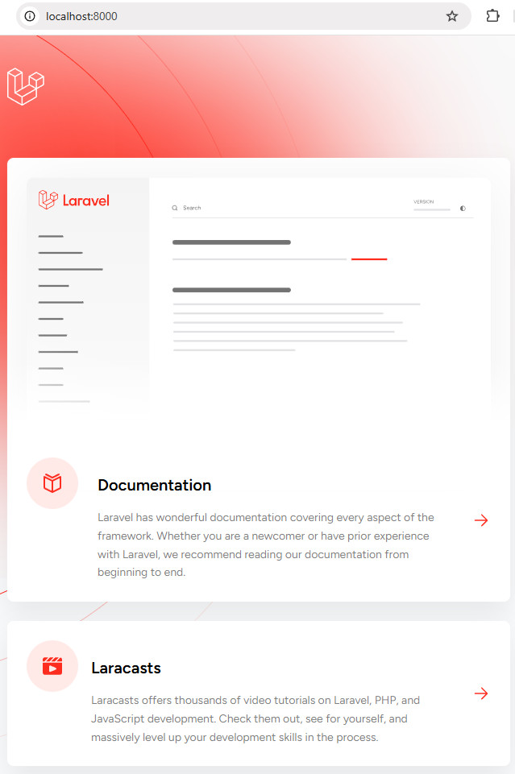

# Продвинутое программирование на PHP — Laravel
## Урок 1. Введение, установка и первичная настройка
### Домашнее задание
<br><br>
Цели практической работы:<br>
Вы научитесь:<br>

• подготавливать окружение для запуска Laravel;<br>
• устанавливать Laravel.<br>


Что нужно сделать:<br>

Сегодня вы установите PHP, composer и фреймворк Laravel, а также проверите его работоспособность с помощью встроенного web-сервера.

1. Установите PHP на компьютер. Для этого вы можете скачать PHP с официального сайта [Laravel.com](https://laravel.com/) или развернуть образ Docker с PHP. Наиболее простой способ, рекомендуемый для выполнения этого задания, — воспользоваться сборкой XAMMP. Скачать сборку для вашей платформы можно на сайте Apache Friends.

2. Откройте утилиту командной строки в своей операционной системе.

3. Выполните команду php -v и убедитесь, что PHP работает.

4. Установите Composer. Выполните необходимые команды, описанные на официальном сайте [getcomposer.org](https://getcomposer.org/).

5. Установите Laravel с помощью Composer. Выполните команду <br>
```composer create-project laravel/laravel <имя проекта>```, <br>
где имя проекта — это имя вашего проекта. Этому имени будет соответствовать имя папки, куда будет помещён проект.
```composer create-project laravel/laravel php-laravel-app```
6. Перейдите в папку, соответствующую имени проекта.

7. Убедитесь, что папка не пустая, и выполните команду <br>
```php artisan serve``` или
```php artisan serve --port=8080```.  <br>
Эта команда запустит встроенный веб-сервер Laravel.

8. Откройте браузер и перейдите по адресу http://localhost:8000 или по адресу http://localhost:8080 . <br> 
Если всё работает правильно, вы увидите страницу с информацией о фреймворке Laravel.

9. Сделайте скриншот.\


### Решение задания

1. Создаем проект командой ```composer create-project laravel/laravel php-laravel-app```
2. В корневой папке проекта устанавливаем ```composer install```
3. Генерируем ключ шифрования ```php artisan key:generate```
4. Очищаем кеш конфигурации ```php artisan config:cache```
5. В папке database проекта создаем пустой файл с именем database.sqlite.
6. Запускаем миграции Laravel с помощью команды```php artisan migrate```
7. Запускаем проект ```php artisan serve```
8. В браузере открываем начальную страницу Laravel по адресу:
``` http://127.0.0.1:8000 ```
<br><br>



<br><br><hr>

**Советы и рекомендации:**<br>

• Внимательно изучите требования по установке в зависимости от вашей операционной системы.<br>
• В случае возникновения ошибок в процессе установки, внимательно читайте сообщения об ошибках: чаще всего они содержат исчерпывающую информацию о сбоях.<br>

<hr>

**В качестве решения приложить:** <br>
➔ ссылку на репозиторий с домашним заданием <br>
⚹ записать необходимые пояснения к выполненному заданию<hr><br>
**Критерии оценки работы:**<br>

**Принято:**
• фреймворк Laravel установлен успешно;<br>
• в браузере по адресу http://localhost:8080 отображается информационная страница о фреймворке Laravel.<br>

**На доработку:**<br>
• выполнены не все пункты задания;<br>
• действия выполнены с ошибками.<br><br><br>


<br><br><br>