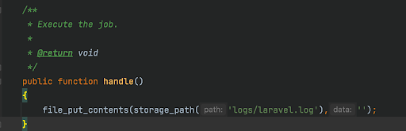
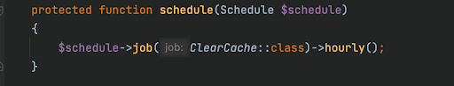

# Продвинутое программирование на PHP — Laravel
## Урок 10. Встроенные возможности Laravel
### Домашнее задание
  
Цели практической работы: 

Научиться: 

— создавать асинхронные задачи и вызывать их; 
— настраивать очередь через базу данных и добавлять в неё задачи; 
— выполнять задачи через планировщик задач Laravel. 

В рамках практической работы вы реализуете очистку файла логирования приложения с помощью асинхронной задачи, помещенной в планировщик задач. 

Что нужно сделать: 

1. Создайте новый проект Laravel или откройте уже существующий.

2. Создайте новую ветку вашего репозитория от корневой (main или master).

3. Создайте миграцию для очереди через базу данных командой php artisan queue:table.

4. Выполните миграцию.

5. Пропишите в файле .env QUEUE_CONNECTION=database.

6. Создайте класс ClearCache.php с помощью команды php artisan make:job ClearCache.

7. В файле ClearCache.php пропишите код для очистки лог-файла. 
 
8. Поместите вызов Job в планировщик задач Laravel в файле app/Console/Kernel.php. 
    
9. Запустите очередь командой php artisan queue:listen.

10. Запустите планировщик задач командой php artisan schedule:work и не закрывайте терминал.

  

**В качестве решения приложить:**  
➔ ссылку на репозиторий с домашним заданием  
⚹ записать необходимые пояснения к выполненному заданию
 
**Что оценивается:** 

**Принято:** 

— выполнены все пункты работы; 
— в работе используются указанные инструменты, соблюдены условия; 
— код корректно отформатирован по стандартам программирования на PHP; 
— код запускается, выводит различные данные на экран, не вызывает ошибок. 

**На доработку:** 
— выполнены не все пункты работы; 
— работа выполнена с ошибками. 

**Как отправить работу на проверку:** 

Отправьте коммит, содержащий код задания, на ветку master в вашем репозитории и пришлите его URL (URL Merge Request’а) через форму. Репозиторий должен быть public.
   

   
