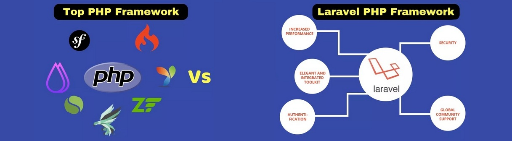

# Продвинутое программирование на PHP — Laravel
## Урок 11. Реализация авторизации
### Домашнее задание
<br><br>
Цели практической работы<br>

Научиться:<br>

— интегрировать регистрацию и аутентификацию пользователей;<br>
— разрабатывать механизмы авторизации действий пользователей системы;<br>
— проектировать ролевую модель системы.<br>


Что нужно сделать:<br>

В этой практической работе вы реализуете проект, в котором будут использованы механизмы авторизации и аутентификации пользователей.<br>

1. Создайте новый проект Laravel или откройте уже существующий.

2. Создайте новую ветку вашего репозитория от корневой (main или master).

3. Установите библиотеку Laravel Breeze composer require laravel/breeze.

4. Установите файлы библиотеки php artisan breeze:install.

5. Соберите фронтенд проекта с помощью команд npm install && npm run dev.

6. Перейдите на ваш сайт и проверьте работу механизмов регистрации и аутентификации.

7. Создайте контроллер UsersController командой php artisan make:controller UsersController.

8. Создайте в классе UsersController функцию index, которая вернёт список всех пользователей системы.

9. Напишите маршрут ‘/users’ в файле web.php.

10. Создайте миграцию, которая добавит поле is_admin типа boolean в таблицу users.

11. Создайте политику php artisan make:policy UserPolicy --model=User и напишите функцию.

```
public function viewAny(User $user)
{
return $user->is_admin;
}
```


12. Зарегистрируйте политику в классе AuthServiceProvider.
```
protected $policies = [
User::class => UserPolicy::class,
];
```


13. Используйте авторизацию действий пользователя внутри контроллера UsersController в функции index.
    ```$this->authorize('view-any', User::class);```

14. Создайте двух пользователей, дайте одному из них роль администратора и попробуйте перейти на маршрут ‘/users’ вашего проекта сначала за неаутентифицированного пользователя, а далее за обычного пользователя и администратора системы.


<br><br><hr>
**В качестве решения приложить:** <br>
➔ ссылку на репозиторий с домашним заданием <br>
⚹ записать необходимые пояснения к выполненному заданию<br>
<hr>

**Критерии оценки работы:** <br>

**Принято:** <br>

— выполнены все пункты работы; <br>
— в работе используются указанные инструменты, соблюдены условия; <br>
— код корректно отформатирован по стандартам программирования на PHP; <br>
— код запускается, выводит данные на экран, не вызывает ошибок. <br>

**На доработку:** <br>
— выполнены не все пункты работы; <br>
— работа выполнена с ошибками. <br>

**Как отправить работу на проверку:** <br>

Отправьте коммит, содержащий код задания, на ветку master в вашем репозитории и пришлите его URL (URL Merge Request’а) через форму. Репозиторий должен быть public.
<br><br><br>



<br><br><br>