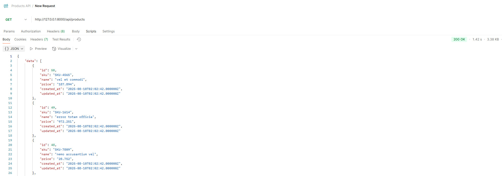
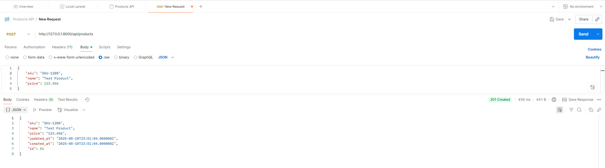
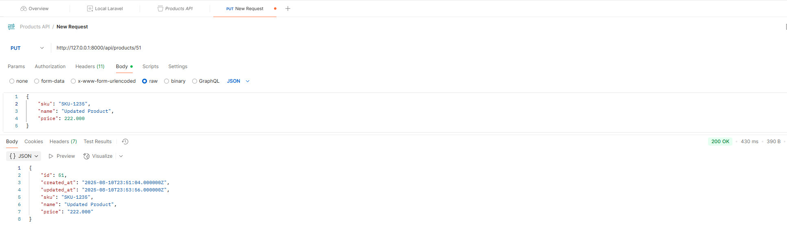
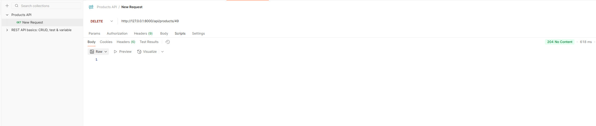

<br><br>
[Назад в README.md](README.md)
<br><br>
## Тестирование маршрутов `/api/products` в Postman

[Результаты тестов в Postman](#postman-result)
<br><br>
### Шаблон `ProductController` под `apiResource`

Данный готовый шаблон `ProductController` (методы index/show/store/update/destroy) имеет валидацию, с добавленными корректными кодами ответов и поддержкой пагинации под `Route::apiResource('products', ProductController::class)` (`apiResource`). <br>
Можно применить шаблон в проекте, указав в `Http/Controllers/ProductController.php`, чтобы поведение в тестировании и коды ответов были как “идеальное REST”:

```
<?php

namespace App\Http\Controllers;

use App\Models\Product;
use Illuminate\Http\Request;
use Illuminate\Http\Response;
use Illuminate\Validation\Rule;
use App\Http\Resources\ProductResource;

class ProductController extends Controller
{
    /**
     * GET /api/products
     * Возвращает пагинированную коллекцию с ключами data/links/meta
     */
    public function index(Request $request)
    {
        $perPage = (int) $request->query('per_page', 15);

        $products = Product::query()
            ->orderByDesc('id')
            ->paginate($perPage);

        // ВАЖНО: ресурсная коллекция → структура { data, links, meta }
        return ProductResource::collection($products);
    }

    /**
     * GET /api/products/{product}
     */
    public function show(Product $product)
    {
        return response()->json($product, Response::HTTP_OK);
    }

    /**
     * POST /api/products
     */
    public function store(Request $request)
    {
        $validated = $request->validate([
            'sku'   => ['required', 'string', 'max:64', 'unique:products,sku'],
            'name'  => ['required', 'string', 'max:255'],
            'price' => ['required', 'numeric', 'between:0,999999.999'],
        ]);

        $product = Product::create($validated);

        return response()
            ->json($product, Response::HTTP_CREATED)
            ->header('Location', route('products.show', $product));
    }

    /**
     * PUT /api/products/{product}
     */
    public function update(Request $request, Product $product)
    {
        $validated = $request->validate([
            'sku'   => [
                'sometimes', 'required', 'string', 'max:64',
                Rule::unique('products', 'sku')->ignore($product->id),
            ],
            'name'  => ['sometimes', 'required', 'string', 'max:255'],
            'price' => ['sometimes', 'required', 'numeric', 'between:0,999999.999'],
        ]);

        $product->fill($validated)->save();

        return response()->json($product, Response::HTTP_OK);
    }

    /**
     * DELETE /api/products/{product}
     */
    public function destroy(Product $product)
    {
        $product->delete();

        return response()->noContent(); // 204
    }
}

```
Примечание:
- `unique` при `update` корректно игнорирует текущую запись через `Rule::unique(...)->ignore($product->id)`.

ProductResource (обязательно для корректной структуры index):
``` 
<?php

namespace App\Http\Resources;

use Illuminate\Http\Resources\Json\JsonResource;

class ProductResource extends JsonResource
{
    public function toArray($request): array
    {
        return [
            'id'         => $this->id,
            'sku'        => $this->sku,
            'name'       => $this->name,
            'price'      => $this->price,
            'created_at' => $this->created_at,
            'updated_at' => $this->updated_at,
        ];
    }
}

```

<br>

### Подготовка к тестированию в Postman

Проверить, что:
- Роуты уже объявлены в `api.php`:
   ```
   // routes/api.php
   use App\Http\Controllers\ProductController;
   Route::apiResource('products', ProductController::class);     
  ```
  
- В модели `Product` есть `fillable`, чтобы POST/PUT работали без MassAssignment:
   ```
   // app/Models/Product.php
   protected $fillable = ['sku', 'name', 'price'];
   protected $casts = ['price' => 'decimal:3'];
   ```  
- Миграции применены и БД настроена:
   ```bash
    php artisan migrate --seed
   ```
  
- Запустить сервер Laravel по умолчанию сервер на `http://127.0.0.1:8000`:
    ```bash
      php artisan serve
    ```
    - Если порт занят, использовать `http://127.0.0.1:8001`, и выполнить команду в консоли: 
    ```bash
      php artisan serve --host 127.0.0.1 --port 8001
    ```
    
- В корне проекта создать папку:
   ```bash
    mkdir postman-screenshots
   ```
- Перейти на [https://web.postman.co/](https://web.postman.co/home) и открыть Postman (Web-версия), но требуется Desktop Agent (статус “Connected”). Или как альтернативный вариант, запустить на ПК [Postman Desktop App](https://www.postman.com/downloads/), тогда агент не нужен.
- Подключить Desktop Agent и в левом нижнем углу проверить, что `Desktop Agent: Connected`. Если не подключён, установить [Postman Desktop Agent](https://www.postman.com/downloads/postman-agent/), кнопка появится в интерфейсе, запустить его и дождаться статуса Connected.
- Проверить подключение запросом к локальному серверу, например `GET http://127.0.0.1:8000/api/products` при запущенном `php artisan serve`.
    
- Создать окружение Environment:
    - Назвать, например, `Local Laravel`.
    - Добавить переменную (Variable):
        - base\_url = `http://127.0.0.1:8000` (или другой порт)
        - product\_id = (оставить пустым и заполнить после `POST`)
    - Выбрать это окружение в правом верхнем углу.
- Создать коллекцию Collection: `Products API`.

<br>

## Выполнение запросов в коллекцию

<hr>

#### 1. Для INDEX добавить запрос: 
``` 
- `GET /api/products`
- Method: GET
- URL: `http://127.0.0.1:8000/api/products`
- Headers: `Accept: application/json`
```  
- Нажать Send и ожидать `200 OK` и JSON-массив.
- Сделать скриншот и сохранить как `postman-screenshots/index.jpeg`.

<hr>

#### 2. Для STORE добавить запрос:
``` 
-`POST /api/products`
- Method: POST
- URL: `http://127.0.0.1:8000/api/products`
- Headers:
    - `Accept: application/json`
    - `Content-Type: application/json`
```    
- В Body -> raw -> JSON изменить имя и цену:
```
{    
    "sku": "SKU-1200",
    "name": "Test Product",
    "price": 123.456
}
```
- Нажать Send, ожидая `201 Created` и JSON-объект с полем `id`.
- Автоматически сохранить id для следующих запросов, вкладка Tests:
```
const data = pm.response.json();
if (data && data.id) {
pm.environment.set("product_id", data.id);
}
```
- Сделать скриншот и сохранить как `postman-screenshots/store.jpeg`.  

<hr>

#### 3. Для SHOW добавить запрос:
``` 
- `GET /api/products/{id}`
- Method: GET
- URL: `http://127.0.0.1:8000/api/products/{{product_id}}`
- Headers: `Accept: application/json`
```  
- Нажать Send и ожидать `200 OK` и JSON-объект продукта.
- Сделать скриншот и сохранить как `postman-screenshots/show.jpeg`.

<hr>

#### 4. Для UPDATE добавить запрос:
``` 
-  `PUT /api/products/{id}` 
  - Method: PUT
  - URL: `http://127.0.0.1:8000/api/products/{{product_id}}`
  - Headers:
      - `Accept: application/json`
      - `Content-Type: application/json`
```  
- В Body -> raw -> JSON изменить имя и цену:
```
{
"sku": "SKU-1234",
"name": "Updated Product",
"price": 222.000
}
```
- Нажать Send и получить (обычно) `200 OK` с обновлённым JSON или `204 No Content`, если контроллер так настроен.
- Сделать скриншот и сохранить как `postman-screenshots/update.jpeg`.

<hr>

#### 5. Для DESTROY добавить запрос:
``` 
    - `DELETE /api/products/{id}` 
    - Method: DELETE
    - URL: `http://127.0.0.1:8000/api/products/{{product_id}}`
    - Headers: `Accept: application/json`
```      
- Нажать Send и получить `204 No Content` или `200 OK` с сообщением, что зависит от контроллера.
- Сделать скриншот и сохранить как `postman-screenshots/destroy.jpeg`.

<hr>
<br>

## Частые ошибки и проверка результата
<br>

#### Коды ошибок и возможность быстрой проверки:

- [ ] Ошибка `404 Not Found` - проверить URL и наличие `Route::apiResource('products', ...)` в `routes/api.php`.

- [ ] Ошибка `422 Unprocessable Entity` - проверить тело JSON и правила валидации.

- [ ] Ошибка `500 / MassAssignmentException` - проверить `$fillable` в `Product`.

- [ ] Ошибка `CORS / не уходит запрос с web.postman.co` (Web Postman не стучится на localhost) - подключить Desktop Agent или использовать Desktop App.

- [ ] Ошибка `419 / CSRF` - значит, для `routes/api.php` CSRF не нужен, и проверить, что действительно обращаешься к `{{base_url}}/api/...`, а не к `web`-роутам.


#### Выполнение скриншотов тестирования:
- Снимать экран так, чтобы было видно метод, URL, статус код, тело ответа. 
- В Windows выполнить комбинацию клавиш `Win + Shift + S`, далее выделить область скриншота, вставить в `Paint/Photos` и нажать `Сохранить как JPEG`.


#### Чек-лист:
- [ ] Сервер Laravel запущен командой `php artisan serve`.
- [ ] В Postman создано и выбрано для теста окружение с `base_url`.
- [ ] Выполнены запросы: GET index, POST store, GET show, PUT update, DELETE destroy.
- [ ] Скриншоты сохранены в `postman-screenshots/` с именами: index.jpeg, show.jpeg, store.jpeg, update.jpeg, destroy.jpeg.

#### API в проекте
- http://127.0.0.1:8000/api/products
- http://127.0.0.1:8000/api/products/48, например, для id=48


<br>

<h2 id="postman-result">Результаты тестов в Postman</h2>


<br>
Результаты тестов в Postman

  - postman-screenshots/index.jpeg <br>
     <br>
  - postman-screenshots/show.jpeg <br>
     <br>
  - postman-screenshots/store.jpeg <br>
     <br>
  - postman-screenshots/update.jpeg <br>
     <br>
  - postman-screenshots/destroy.jpeg <br>
     <br>

<br><br>
[Назад в README.md](README.md)
<br><br><br><br>


