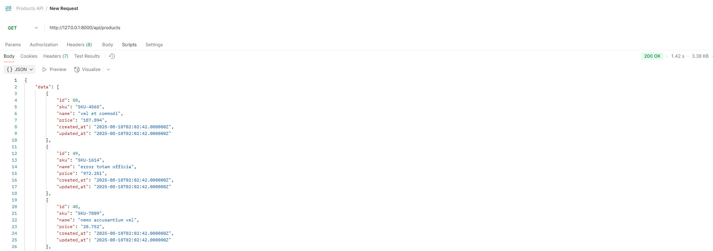
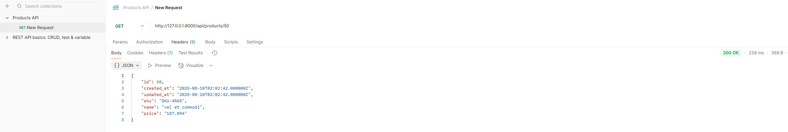
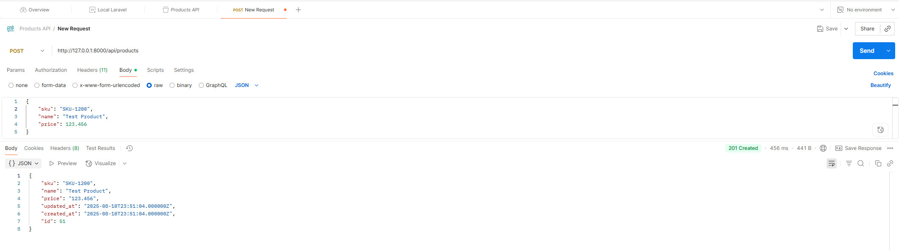
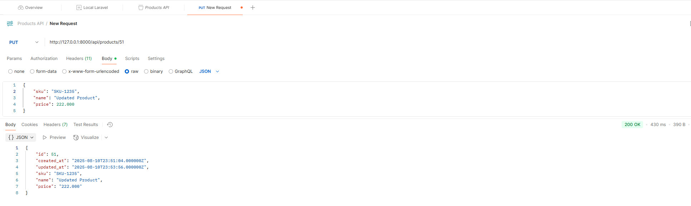
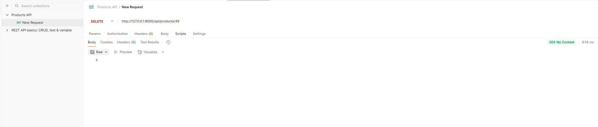

# Продвинутое программирование на PHP — Laravel
## Урок 13. Тестирование и отладка Laravel-приложений
### Домашнее задание
<br><br>
Цели практической работы<br>

Научиться:<br>

— создавать класс-фабрику и класс-наполнитель и использовать их;<br>
— создавать контроллер и тестировать его с помощью Postman;<br>
— писать feature-тесты для проверки работы методов контроллера.<br>

Что нужно сделать:<br>

В этой практической работе вы реализуете уведомления через внешние сервисы.<br>

1. Создайте новый проект Laravel или откройте уже существующий.

2. Создайте новую ветку вашего репозитория от корневой (main или master).

3. Создайте сущность Product (модель, миграцию и контроллер) командой php artisan make:model Product -mc.

4. Опишите миграцию для таблицы products c типами полей:

```
$table->string('sku');
$table->string('name');
$table->decimal('price', 9, 3);
```

5. Выполните миграцию командой php artisan migrate.

6. Добавьте в файл api.php маршруты:
```
Route::apiResource('products', \App\Http\Controllers\ProductController::class);
```   

7. Создайте класс-фабрику для сущности Product c помощью команды php artisan make:factory ProductFactory.

8. Создайте класс-наполнитель для сущности Product c помощью команды php artisan make:seeder ProductsSeeder.

9. Выполните команду php artisan migrate –-seed для наполнения базы данных сгенерированными данными.

10. В классе ProductController реализуйте методы index, show, store, update, destroy.

11. Протестируйте каждый из маршрутов контроллера ProductController с помощью Postman и приложите скриншоты ответа на запросы в папку postman-screenshots (названия файлов должны соответствовать формату index.jpeg, show.jpeg, store.jpeg, update.jpeg, destroy.jpeg для каждого метода, соответственно).

12. Создайте тест c помощью команды php artisan make:test Products/ProductTest.

13. Опишите функции:

```
test_products_can_be_indexed,
test_product_can_be_shown,
test_product_can_be_stored,
test_product_can_be_updated,
test_product_can_be_destroyed.

```

14. Запустите выполнение тестов командой php artisan test.


##
## Домашнее задание
Открыть терминал и перейти в папку с уроком:
```
cd hw-13
```

<br>

## Инструкция
### 1. Создать новый проект Laravel

- Открыть терминал и выполнить команду:
```
laravel new thirteenth-laravel-app
```

- Перейти в созданную директорию проекта:
```
cd thirteenth-laravel-app
```
<br>

### 2. Создать новую ветку репозитория

- Инициализировать git-репозиторий:
```
git init
```

- Создать и переключиться на новую ветку:
```
git checkout -b feature/products-crud
```

<br>

### 3. Создать сущность Product

Выполнить команду для создания модели, миграции и контроллера:
```
php artisan make:model Product -mc
```
<br>

### 4. Описать миграцию таблицы products

- Открыть файл миграции из каталога `database/migrations`, в методе `up` добавить:

```
$table->string('sku');
$table->string('name');
$table->decimal('price', 9, 3);
```
- Сохранить файл.

<br>

### 5. Выполнить миграцию базы данных

В Laravel миграции не вызываются вручную, а находятся и выполняются самим фреймворком по имени файла. <br>
Если в редакторе видно, что классы "не используются", на самом деле Laravel подхватит классы при выполнении команды
`php artisan migrate`. Но, предварительно в коде можно добавить над классом PHPDoc-аннотацию для подавления предупреждения `Anonymous classes`:
```
/** @noinspection PhpUnused */
class CreateProductsTable extends Migration
```

Запустить команду:
```
php artisan migrate
```

<br>

### 6. Добавить маршруты API

Создать файл `routes/api.php` и добавить в `api.php` маршрут:
```
<?php

use App\Http\Controllers\ProductController;
use Illuminate\Support\Facades\Route;

Route::apiResource('products', ProductController::class);

```
<br>

### 7. Создать класс-фабрику для Product

- Выполнить команду:
```
php artisan make:factory ProductFactory
```

- Открыть файл `database/factories/ProductFactory.php` и добавить генерацию данных:
```
public function definition()
{
    return [
        'sku' => $this->faker->unique()->bothify('SKU-####'),
        'name' => $this->faker->words(3, true),
        'price' => $this->faker->randomFloat(3, 10, 999),
    ];
}
```
<br>

### 8. Создать класс-наполнитель ProductsSeeder

- Выполнить команду:

```
php artisan make:seeder ProductsSeeder
```

- Открыть файл `database/seeders/ProductsSeeder.php` и добавить наполнение к методу `run()`:

```
use App\Models\Product;

public function run()
{
    Product::factory()->count(10)->create();
}
```

- Открыть файл `DatabaseSeeder.php` и вызвать `ProductsSeeder`, чтобы Laravel при выполнении команды `php artisan db:seed` или `php artisan migrate --seed`, запустил сидер `ProductsSeeder` вместе с остальными - вставить внутри метода run() код:
```
$this->call(ProductsSeeder::class);
```
Это необходимо, чтобы сначала создавался `Test User`, а потом добавлялись продукты - строку кода указать внизу метода. <br>
Если продукты должны быть загружены первыми, то нужно переместить строку `$this->call(ProductsSeeder::class);` вверх метода перед `User::factory()`.

- В модель `app/Models/Product.php` добавить `HasFactory` и fillable-поля, то есть добавить защиту, указав в модели `Product` разрешённые поля `protected $fillable = ['sku', 'name', 'price'];`:

``` 
<?php

namespace App\Models;

use Illuminate\Database\Eloquent\Factories\HasFactory;
use Illuminate\Database\Eloquent\Model;

class Product extends Model
{
    use HasFactory;

    protected $fillable = ['sku', 'name', 'price'];
}
```
- В файле фабрики `database/factories/ProductFactory.php`, чтобы фабрика явно привязана к модели через `$model`, добавить `protected $model = Product::class;`:
``` 
<?php

namespace Database\Factories;

use Illuminate\Database\Eloquent\Factories\Factory;
use App\Models\Product;

class ProductFactory extends Factory
{
    /** @var class-string<\App\Models\Product> */
    protected $model = Product::class;

    public function definition(): array
    {
        return [
            'sku'   => $this->faker->unique()->bothify('SKU-####'),
            'name'  => $this->faker->words(3, true),
            'price' => $this->faker->randomFloat(3, 10, 999),
        ];
    }
}
```
- В сидере `database/seeders/ProductsSeeder.php` проверить наличие кода:
``` 
<?php

namespace Database\Seeders;

use Illuminate\Database\Seeder;
use App\Models\Product;

class ProductsSeeder extends Seeder
{
    public function run(): void
    {
        Product::factory()->count(50)->create();
    }
}
```

- Исправить `DatabaseSeeder.php`, чтобы запись либо обновлялась, либо создавалась один раз:
```
<?php

namespace Database\Seeders;

use Illuminate\Database\Seeder;
use App\Models\User;
use Illuminate\Support\Facades\Hash;
use Illuminate\Support\Str;

class DatabaseSeeder extends Seeder
{
    public function run(): void
    {
        // Идемпотентное создание тестового пользователя
        User::updateOrCreate(
            ['email' => 'test@example.com'],
            [
                'name' => 'Test User',
                'password' => Hash::make('password'), // можно изменить на свой
                'email_verified_at' => now(),
                'remember_token' => Str::random(10),
            ]
        );

        $this->call(ProductsSeeder::class);
    }
}
```
Или можно заменить на `firstOrCreate(...)`, если не нужно обновлять поля при повторном запуске.
``` 
<?php

namespace Database\Seeders;

use Illuminate\Database\Seeder;
use App\Models\User;
use Illuminate\Support\Facades\Hash;
use Illuminate\Support\Str;

class DatabaseSeeder extends Seeder
{
    public function run(): void
    {
        // Создаст пользователя, если его ещё нет; при повторных запусках — просто вернёт существующего
        $user = User::firstOrCreate(
            ['email' => 'test@example.com'],
            [
                'name' => 'Test User',
                'password' => Hash::make('password'),
            ]
        );

        // Гарантированно проставим служебные поля только при первом создании
        if ($user->wasRecentlyCreated) {
            $user->forceFill([
                'email_verified_at' => now(),
                'remember_token'    => Str::random(10),
            ])->save();
        }

        // Продукты
        $this->call(ProductsSeeder::class);
    }
}
```

<br>

### 9. Выполнить миграцию с наполнением базы

- Перезапусти автозагрузку:
``` 
composer dump-autoload
```

- Запустить команду:
```
php artisan migrate --seed
```

<br>

### 10. Реализовать методы в контроллере ProductController

Открыть файл `app/Http/Controllers/ProductController.php` и добавить методы:
```
use App\Models\Product;
use Illuminate\Http\Request;

public function index()
{
    return Product::all();
}

public function show($id)
{
    return Product::findOrFail($id);
}

public function store(Request $request)
{
    $product = Product::create($request->all());
    return response()->json($product, 201);
}

public function update(Request $request, $id)
{
    $product = Product::findOrFail($id);
    $product->update($request->all());
    return response()->json($product, 200);
}

public function destroy($id)
{
    Product::destroy($id);
    return response()->json(null, 204);
}
```

<br>

### 11. Протестировать маршруты в Postman

Запустить сервер Laravel:
```
php artisan serve
```

Открыть [Postman](https://web.postman.co/home) и [выполнить запросы](POSTMAN_api.md):
```
* GET /api/products
* GET /api/products/{id}
* POST /api/products
* PUT /api/products/{id}
* DELETE /api/products/{id}
```

Сохранить скриншоты ответов в папку postman-screenshots, например, с именами запросов:
* index.jpeg
* show.jpeg
* store.jpeg
* update.jpeg
* destroy.jpeg <br>

[Посмотреть результаты теста посмотреть по ссылке:](POSTMAN_api.md#результаты-тестов-в-postman)

[Результаты теста в Postman](POSTMAN_api.md)


<br>

### 12. Проверить список роутов

- Посмотреть список роутов сначала без фильтра, чтобы точно увидеть всё, что есть:

```
php artisan route:list
```

Затем отфильтруй по пути и проверить список роутов, в обычной среде должны быть методы GET, POST, GET/{id}, PUT/PATCH/{id}, DELETE/{id}.:
``` 
php artisan route:list --path=api/products
```

Должны появиться 5 маршрутов:
- GET|HEAD api/products -> products.index
- POST api/products -> products.store
- GET|HEAD api/products/{product} -> products.show
- PUT|PATCH api/products/{product} -> products.update
- DELETE api/products/{product} -> products.destroy
  

- Альтернативная проверка по именам:

``` 
php artisan route:list --name=products
```

<br>

### 13. Создать ресурс для index()

Сделать ресурс и использовать его в index().

- Создать ресурс:

```bash
php artisan make:resource ProductResource
```

- Заполнить `app/Http/Resources/ProductResource.php`:
``` 
<?php

namespace App\Http\Resources;

use Illuminate\Http\Resources\Json\JsonResource;

class ProductResource extends JsonResource
{
    public function toArray($request): array
    {
        return [
            'id'         => $this->id,
            'sku'        => $this->sku,
            'name'       => $this->name,
            'price'      => $this->price, // у тебя cast decimal:3 — ок
            'created_at' => $this->created_at,
            'updated_at' => $this->updated_at,
        ];
    }
}
```

- Обновить index() в контроллере:
``` 
// app/Http/Controllers/ProductController.php
use App\Http\Resources\ProductResource;
use Illuminate\Http\Request;
use Illuminate\Http\Response;

public function index(Request $request)
{
    $perPage = (int) $request->query('per_page', 15);

    $products = Product::query()
        ->orderByDesc('id')
        ->paginate($perPage);

    // ВАЖНО: ресурсная коллекция над пагинатором → появятся keys data/links/meta
    return ProductResource::collection($products);
}
```

### 14. Создать тест ProductTest

- Выполнить команду:
```
php artisan make:test Products/ProductTest
```
<br>

### 15. Написать функции тестирования

Открыть файл `tests/Feature/Products/ProductTest.php` и добавить методы:
```
use App\Models\Product;
use Illuminate\Foundation\Testing\RefreshDatabase;

public function test_products_can_be_indexed()
{
    Product::factory()->count(3)->create();

    $response = $this->getJson('/api/products');

    $response->assertStatus(200);
}

public function test_product_can_be_shown()
{
    $product = Product::factory()->create();

    $response = $this->getJson('/api/products/' . $product->id);

    $response->assertStatus(200);
}

public function test_product_can_be_stored()
{
    $data = [
        'sku' => 'TEST1234',
        'name' => 'Test Product',
        'price' => 123.456,
    ];

    $response = $this->postJson('/api/products', $data);

    $response->assertStatus(201);
}

public function test_product_can_be_updated()
{
    $product = Product::factory()->create();

    $response = $this->putJson('/api/products/' . $product->id, [
        'name' => 'Updated Name',
    ]);

    $response->assertStatus(200);
}

public function test_product_can_be_destroyed()
{
    $product = Product::factory()->create();

    $response = $this->deleteJson('/api/products/' . $product->id);

    $response->assertStatus(204);
}
```

<br>

### 16. Запустить тестирование

- Запустить команды:
``` 
php artisan route:clear
php artisan optimize:clear
```

- Выполнить команду:
```
php artisan test
```
- Проверить, что все тесты выполнены успешно.
- При необходимости исправить ошибки и повторно запустить тестирование.
- Получить и записать результаты, например:
``` 
   PASS  Tests\Unit\ExampleTest
  вњ“ that true is true                                                    0.01s  

   PASS  Tests\Feature\ExampleTest
  вњ“ the application returns a successful response                        0.38s  

   PASS  Tests\Feature\Products\ProductTest
  ✓ homepage is ok                                                       0.26s
  ✓ products can be indexed                                              0.06s
  ✓ product can be shown                                                 0.03s
  ✓ product can be stored                                                0.04s
  ✓ product can be updated                                               0.03s
  ✓ product can be destroyed                                             0.03s

  Tests:    8 passed (41 assertions)
  Duration: 1.05s
```
<br>

### API в проекте

- http://127.0.0.1:8000/page исходная страница проекта
- http://127.0.0.1:8000/ Главная страница проекта
- http://127.0.0.1:8000/api/products
- http://127.0.0.1:8000/api/products/48, например, для id=48
- http://127.0.0.1:8000/products - страница с поиском и сортировкой, те же данные БД, что и в /api/products.


<br>

## Результаты тестов в Postman

<br>
Скриншоты результатов тестов в Postman

- postman-screenshots/index.jpeg <br>
   <br>
- postman-screenshots/show.jpeg <br>
   <br>
- postman-screenshots/store.jpeg <br>
   <br>
- postman-screenshots/update.jpeg <br>
   <br>
- postman-screenshots/destroy.jpeg <br>
   <br>


<br><br><hr>
**В качестве решения приложить:** <br>
➔ ссылку на репозиторий с домашним заданием <br>
⚹ записать необходимые пояснения к выполненному заданию<br>
<hr>

**Критерии оценки работы:** <br>

**Принято:** <br>

— выполнены все пункты работы; <br>
— в работе используются указанные инструменты, соблюдены условия; <br>
— код корректно отформатирован по стандартам программирования на PHP; <br>
— код запускается, выводит данные на экран, не вызывает ошибок. <br>

**На доработку:** <br>
— выполнены не все пункты работы; <br>
— работа выполнена с ошибками. <br>

**Как отправить работу на проверку:** <br>

Отправьте коммит, содержащий код задания, на ветку master в вашем репозитории и пришлите его URL (URL Merge Request’а) через форму. Репозиторий должен быть public.
<br><br><br>


<br><br><br>