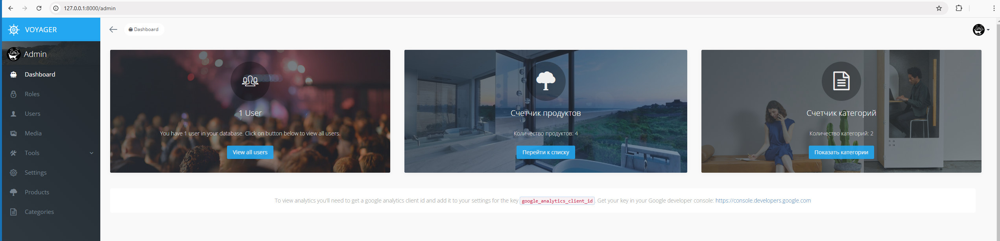
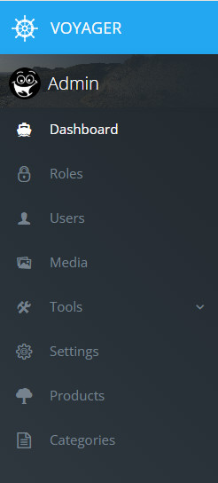
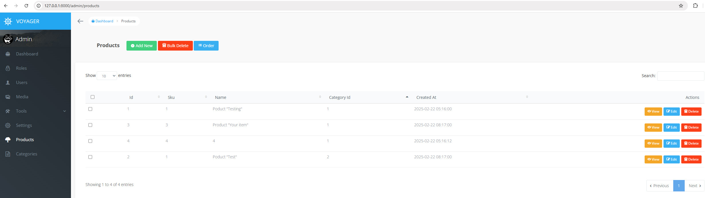
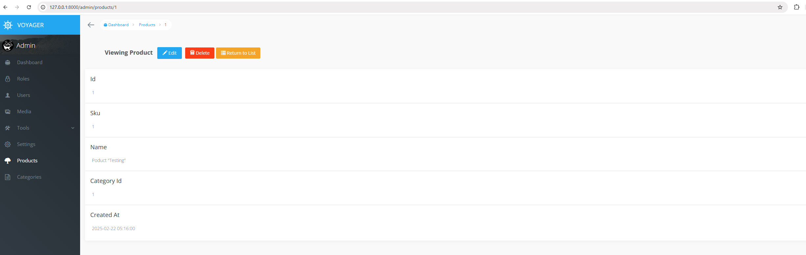
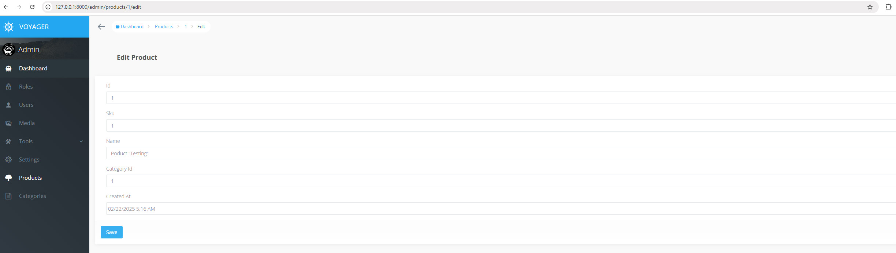
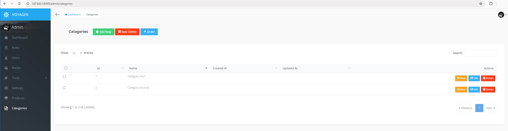
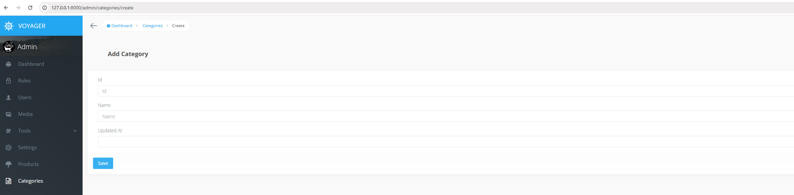
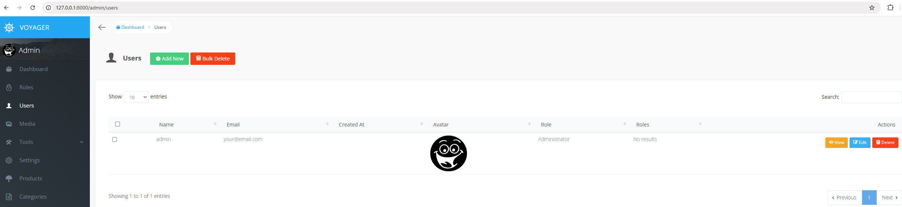
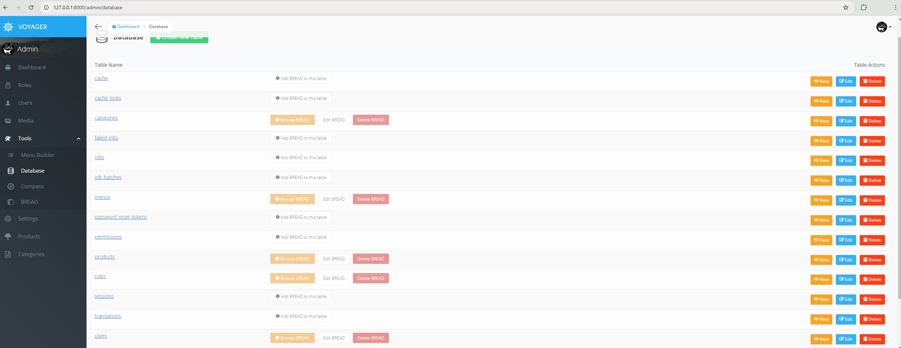

# Продвинутое программирование на PHP — Laravel
## Урок 14. Создание администраторской панели
### Домашнее задание
<br><br>
Цели практической работы:<br>

— Научиться интегрировать админ-панель в проект. <br>
— Разобраться в настройке CRUD-методов для сущности в voyager. <br>

Что нужно сделать:<br>

В этой практической работе вы создадите панель администратора для склада интернет-магазина.<br>

1. Создайте новый проект Laravel или откройте уже существующий.

2. Создайте новую ветку вашего репозитория от корневой (main или master).

3. Создайте класс Category (модель, миграцию и контроллер) командой 
``` 
php artisan make:model Category -m 

```

4. Опишите миграцию для таблицы categories c типами полей:

```
$table->id();
$table->string('name');
$table->timestamps();
```

5. Создайте класс Product (модель, миграцию и контроллер) командой 
```
php artisan make:model Product -m

```
6. Опишите миграцию для таблицы products c типами полей:

```
$table->string('sku');
$table->id();
$table->string('sku');
$table->string('name');
$table->foreignId('category_id')->constrained();
```

7. Выполните миграцию командой 
```
php artisan migrate

```

8. Установите voyager командой 
```
composer require tcg/voyager

```
9. Выполните установку voyager внутри вашего приложения командой 
```
php artisan voyager:install
php artisan voyager:publish
php artisan migrate
```

10. Создайте администратора вашего приложения командой 
```
php artisan voyager:admin your@email.com

```

11. Войдите в панель администратора, перейдите во вкладку tools/bread и добавьте возможность редактирования сущностей category и product.

12. После создания CRUD для сущности product перейдите в эту сущность и нажмите на кнопку Create A Relationship.

13. Настройте связь следующим образом: <br>
<br>
14. Сохраните связь.

15. Создайте категорию, а после — тестовый товар, прикреплённый к этой категории.

16. Создайте в проекте директорию App/Admin/Widgets и добавьте туда два виджета: ProductsWidget и CategoriesWidget.

17. Реализуйте в этих виджетах счётчики количества товаров и категорий.

18. Добавьте виджеты в конфигурационный файл voyager.php:
19. 
```
'widgets' => [
\App\Admin\Widgets\ProductsWidget::class,
\App\Admin\Widgets\CategoriesWidget::class,
],
```

<br><br>

## Домашнее задание

1. Создаем новую базу данных MySQL
   1.1. Открываем XAMPP Control Panel и запускаем Apache и MySQL.
   1.2. Переходим в phpMyAdmin по адресу http://localhost/phpmyadmin.
   1.3. Создаем новую базу данных с именем 'warehouse-management'

2. Создаем новый проект Laravel
2.1. Открываем терминал и выполняем команду для создания нового проекта Laravel
```php
composer create-project --prefer-dist laravel/laravel warehouse-management

```
2.2. Переходим в директорию проекта
```php
cd warehouse-management

```
3. Настраиваем подключение к базе данных
3.1. Открываем файл .env в корне проекта и указываем подключение к базе данных
```
DB_CONNECTION=mysql
DB_HOST=127.0.0.1
DB_PORT=3319
DB_DATABASE=warehouse-management
DB_USERNAME=root
DB_PASSWORD=
```
3.2.
Проверяем подключение проекта к базе данных
```php
php artisan migrate
php artisan serve
// открываем страниуц http://localhost:8000/ в браузере

```

4. Создание модели Category
4.1. Выполняем команду для создания модели, миграции и контроллера
```php
php artisan make:model Category -m

```

4.2. Открываем созданный файл миграции xxxx_create_categories_table.phpв database/migrations и изменяем его
```php
public function up()
{
Schema::create('categories', function (Blueprint $table) {
$table->id();
$table->string('name');
$table->timestamps();
});
}

```
5. Создание модели Product
5.1. Выполняем команду для создания модели, миграции и контроллера
```php
php artisan make:model Product -m

```

5.2. Открываем созданный файл миграции xxxx_create_products_table.php в database/migrations и изменяем его
```php
public function up()
{
Schema::create('products', function (Blueprint $table) {
$table->id();
$table->string('sku');
$table->string('name');
$table->foreignId('categories_id')->constrained()->onDelete('cascade');
$table->timestamps();
});
}

```
6. Выполнение миграций
6.1. Выполняем команду для применения миграций
```php
php artisan migrate

```
6.2. Очищаем кеш после выполнения миграции
```php
php artisan config:clear
php artisan route:cache
```
7. Установка Voyager
7.1. Устанавливаем Voyager с помощью Composer
```php
composer require tcg/voyager

```
7.2. Устанавливаем зависимости Voyager
```php
php artisan voyager:install
php artisan voyager:publish
php artisan migrate
```
7.3. При необходимости выполняем команду для удаления пакета Voyager
```php
composer remove tcg/voyager
```
После удаления пакета, удаляем папки, созданные пакетом Voyager вручную, если они еще существуют, это папки: public/voyager и storage/voyager. И Voyager устанавливаем заново, повторяя пункты 7.

8. Создание администратора
8.1. Следует проверить, что у пользователя есть роль администратора. Если роль не назначена, прописать командой следуя данным из таблицы users для получения права дминистратора
```php
php artisan voyager:admin your@email.com

```

8.2. Можно назначить хешированный пароль администратора, выполнив команду открыть Tinker
```php
php artisan tinker
```
и выполнить следующие команды в Tinker:
```php
$user = App\Models\User::find(1);
$user->password = bcrypt('admin');
$user->save();
```
Хешированный пароль записать в базу данных. <br><br>

9. Выполнить дополнительные действия для очистки кэша

```php
php artisan migrate

php artisan voyager:install
php artisan voyager:publish
php artisan voyager:seed-bread

```
10. Использовать email your@email.com и пароль admin после выполнения предыдущих пунктов 8. Войти в панель администратора Voyager по адресу http://localhost:8000/admin, используя your@email.com и пароль admin. 

```php
php artisan serve 

```
<br><br><hr>

## Выполнение работы

<br><br>

<br><br>

<br><br>

<br><br>

<br><br>

<br><br>

<br><br>

<br><br>

<br><br>

<br><br>

<br><br><hr>

## Инструкция

<br><br>

### Настройка ключа шифрования (app key)

Важно, чтобы был правильно настроен ключ шифрования (app key), который используется для различных операций безопасности, включая шифрование сессий и паролей. <br>
Даже если ключ указан в файле .env, может возникать проблема, что этот файл не был загружен или ключ еще не сохранён в конфигурационных файлах Laravel. <br><br>
Есть некоторые действия, которые помогут решить данную проблему:

1. Необходимо проверить, что ключ действительно существует, для этого следует открыть файл .env и убедитесь, что строка APP_KEY= содержит действительный ключ, например, как в примере:
```php
APP_KEY=base64:jhKxP6j8xBdyrBfLQ9EfT9WDKx7Vhto5cIvNlqMBrbY=

```

2. Требуется сгенерировать новый ключ. Эта команда автоматически создаст новый ключ и обновит файл .env.  <br>Выполнить команду для генерации нового ключа:
```php
php artisan key:generate

```
3. Сразу после того, как удасться проверить, что ключ установлен правильно, необходима очистка кеша конфигурации. <br>Сбросить кеш конфигурации, выполнить команду:
```php
php artisan config:clear

```
4. Перезапустите сервер
   После выполнения всех вышеуказанных действий нужно перезапустить сервер командой:
```php
php artisan serve

```
### Работа с пакетом библиотеки Voyager

1. Удаление пакета

1.1. Выполнить команду для удаления пакета Voyager:
   ```bash
   composer remove tcg/voyager
   ```
1.2. После удаления необходимо проверить и удалить папки, созданные пакетом Voyager вручную, если они еще существуют:
- `public/voyager`
- `storage/voyager`

2. Переустановка пакета

2.1. Установить пакет Voyager снова:
   ```bash
   composer require tcg/voyager
   ```
2.2. Запустить миграцию базы данных:
   ```bash
   php artisan migrate
   ```
2.3. Опубликовать ресурсы Voyager:
   ```bash
   php artisan voyager:install
   ```
2.4. Если необходимо использовать образцовые данные BREAD (CRUD), выполнить следующую команду:
   ```bash
   php artisan voyager:seed-bread
   ```

3. Указание администратора системы

Когда пакет Voyager установлен и настроен заново, можно указать нужного администратора системы.
3.1. Войти в панель администрирования Voyager.
3.2. Перейти в раздел **Users** («Пользователи»).
3.3. Создать нового пользователя с правами администратора или отредактировать существующего пользователя, чтобы присвоить ему права администратора.

4. Удаление и переустановка Voyager
Если предыдущие шаги не помогли, попробуйте удалить и повторно установить пакет Voyager

4.1. Удаление пакета Voyager:
```php
composer remove tcg/voyager

```

4.2. Переустановка пакета Voyager:
```php
composer require tcg/voyager

```

4.3. Опубликование конфигурационных файлов и миграция:
```php
php artisan voyager:install
php artisan voyager:publish
php artisan migrate

```


<br><br><hr>
**В качестве решения приложить:** <br>
➔ ссылку на репозиторий с домашним заданием <br>
⚹ записать необходимые пояснения к выполненному заданию<br>
<hr>

**Критерии оценки работы:** <br>

**Принято:** <br>

— выполнены все пункты работы; <br>
— в работе используются указанные инструменты, соблюдены условия; <br>
— код корректно отформатирован по стандартам программирования на PHP; <br>
— код запускается, выводит данные на экран, не вызывает ошибок. <br>

**На доработку:** <br>
— выполнены не все пункты работы; <br>
— работа выполнена с ошибками. <br>

**Как отправить работу на проверку:** <br>

1. Отправьте коммит, содержащий код задания, на ветку master в вашем репозитории и пришлите его URL (URL Merge Request’а) через форму. Репозиторий должен быть public.

2. Сделайте скриншоты следующих частей вашего приложения:
   — дашборда администратора с виджетами, <br>
   — левого меню панели администратора с новыми пунктами (категории и продукты), <br>
   — раздела продуктов, <br>
   — страницы создания продукта, <br>
   — страницы просмотра одного продукта, <br>
   — страницы редактирования продукта, <br>
   — раздела категорий. <br>
   <br><br><br>


<br><br><br>