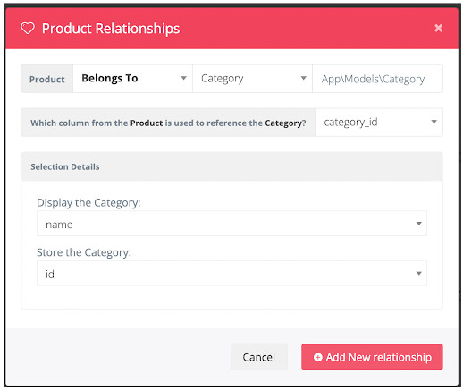

# Продвинутое программирование на PHP — Laravel
## Урок 14. Создание администраторской панели
### Домашнее задание
<br><br>
Цели практической работы:<br>

— Научиться интегрировать админ-панель в проект. <br>
— Разобраться в настройке CRUD-методов для сущности в voyager. <br>

Что нужно сделать:<br>

В этой практической работе вы создадите панель администратора для склада интернет-магазина.<br>

1. Создайте новый проект Laravel или откройте уже существующий.

2. Создайте новую ветку вашего репозитория от корневой (main или master).

3. Создайте класс Category (модель, миграцию и контроллер) командой php artisan make:model Category -m

4. Опишите миграцию для таблицы categories c типами полей:

```
$table->id();
$table->string('name');
$table->timestamps();
```

5. Создайте класс Product (модель, миграцию и контроллер) командой php artisan make:model Product -m
6. Опишите миграцию для таблицы products c типами полей:

```
$table->string('sku');
$table->id();
$table->string('sku');
$table->string('name');
$table->foreignId('category_id')->constrained();
```

7. Выполните миграцию командой php artisan migrate

8. Установите voyager командой composer require tcg/voyager

9. Выполните установку voyager внутри вашего приложения командой php artisan voyager:install

10. Создайте администратора вашего приложения командой php artisan voyager:admin your@email.com

11. Войдите в панель администратора, перейдите во вкладку tools/bread и добавьте возможность редактирования сущностей category и product.

12. После создания CRUD для сущности product перейдите в эту сущность и нажмите на кнопку Create A Relationship.

13. Настройте связь следующим образом: <br>
<br>
14. Сохраните связь.

15. Создайте категорию, а после — тестовый товар, прикреплённый к этой категории.

16. Создайте в проекте директорию App/Admin/Widgets и добавьте туда два виджета: ProductsWidget и CategoriesWidget.

17. Реализуйте в этих виджетах счётчики количества товаров и категорий.

18. Добавьте виджеты в конфигурационный файл voyager.php:
19. 
```
'widgets' => [
\App\Admin\Widgets\ProductsWidget::class,
\App\Admin\Widgets\CategoriesWidget::class,
],
```

<br><br><hr>
**В качестве решения приложить:** <br>
➔ ссылку на репозиторий с домашним заданием <br>
⚹ записать необходимые пояснения к выполненному заданию<br>
<hr>

**Критерии оценки работы:** <br>

**Принято:** <br>

— выполнены все пункты работы; <br>
— в работе используются указанные инструменты, соблюдены условия; <br>
— код корректно отформатирован по стандартам программирования на PHP; <br>
— код запускается, выводит данные на экран, не вызывает ошибок. <br>

**На доработку:** <br>
— выполнены не все пункты работы; <br>
— работа выполнена с ошибками. <br>

**Как отправить работу на проверку:** <br>

1. Отправьте коммит, содержащий код задания, на ветку master в вашем репозитории и пришлите его URL (URL Merge Request’а) через форму. Репозиторий должен быть public.

2. Сделайте скриншоты следующих частей вашего приложения:
   — дашборда администратора с виджетами, <br>
   — левого меню панели администратора с новыми пунктами (категории и продукты), <br>
   — раздела продуктов, <br>
   — страницы создания продукта, <br>
   — страницы просмотра одного продукта, <br>
   — страницы редактирования продукта, <br>
   — раздела категорий. <br>
   <br><br><br>


<br><br><br>