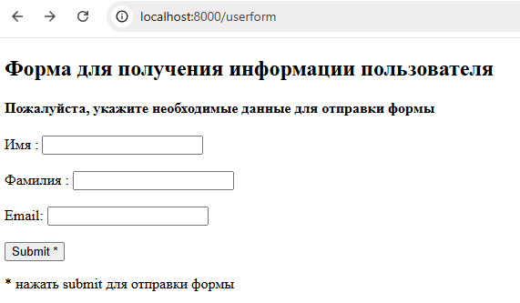
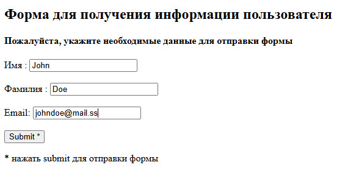
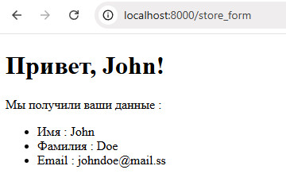

# Продвинутое программирование на PHP — Laravel
## Урок 2. Контроллеры, экшены и роутинг
### Домашнее задание
  
Цели: 

Вы научитесь: 

— устанавливать Laravel; 
— создавать контроллер, возвращающий JSON; 
— создавать контроллер для обработки формы; 
— создавать контроллер, возвращающий шаблон. 

Что нужно сделать: 

Вам предстоит установить фреймворк Laravel и создать контроллер, содержащий экшены для вывода и обработки формы. 

1. Установите Laravel с помощью composer, выполнив команду composer create-project laravel/laravel <имя проекта>.  
   В поле <имя проекта> впишите имя вашего проекта. Этому имени будет соответствовать имя папки, в которую вы поместите проект. 

2. Создайте контроллер для вывода формы на страницу и её обработки.  
   В командную строку введите команду php artisan make:controller FormProcessor. 

3. После выполнения команды убедитесь, что контроллер создан, — соответствующий файл должен появиться в папке app/Http/Controllers.

4. Внутри контроллера опишите метод index: он должен выводить в браузер форму для заполнения. 
   — Опишите форму в виде шаблона blade. 
   — Внутри формы должны быть поля для ввода имени, фамилии и email пользователя. 
   — Форма отправляется методом POST. 
   — Параметр action пока оставьте пустым. 
   — Не забудьте про CSRF. 

5. Внутри файла /routes/web.php опишите новый роут (метод GET), который будет вызывать метод index контроллера FormProcessor по url /userform.

6. Запустите встроенный сервер Laravel командой php artisan serve --port=8080 и убедитесь, что форма выводится по адресу http://localhost:8080/userform.

7. В контроллере FormProcessor создайте метод store для обработки формы. Этот метод должен принимать поля формы и отправлять ответ в виде JSON-объекта, содержащего значения полей формы (имя, фамилия, email).

8. Внутри файла /routes/web.php опишите новый роут (метод POST), который будет вызывать метод store контроллера FormProcessor по url /store_form.

9. Отредактируйте поле action формы в шаблоне и укажите адрес /store_form.

10. Откройте форму в браузере по адресу http://localhost:8080/userform, заполните её и попробуйте отправить на сервер, нажав кнопку Submit. Если всё сделано правильно, вы увидите в браузере объект JSON.

11. Создайте новый шаблон blade для приветствия пользователя (например: «Привет, <имя>!»).

12. Измените метод store контроллера FormProcessor таким образом, чтобы вместо JSON он возвращал шаблон, заполненный данными пользователя.

13. Сделайте коммит своих изменений с помощью git и отправьте push в репозиторий.

### Решение задание

1. Создаем шаблоны для страниц в папке views/user для Формы form.blade.php и Поля Ответного приветствия greeting.blade.php
2. Создаем контроллер UserController.php с методом index, который будет возвращать представление с формой
3. Создаем контроллер FormProcessor.php с обработкой методов GET и POST
4. Добавляем маршрут файле routes/web.php и прописываем путь к контроллерам и указываем адрес обращения к страницы формы
5. Запускаем страницу в браузере по адресу http://localhost:8000/userform   
   
6. Заполняем необходимые данные   
   
7. После отправки формы, получаем ответ со страницы приветствия   
  

   

**Советы и рекомендации** 
Старайтесь писать в commit message то, что отражает смысл вашего кода. 

  

**В качестве решения приложить:**  
➔ ссылку на репозиторий с домашним заданием  
⚹ записать необходимые пояснения к выполненному заданию
 
**Критерии оценки работы:** 

**Принято:** 
— выполнены все пункты задания; 
— в работе используются указанные инструменты и соблюдены условия; 
— код корректно отформатирован по стандартам программирования на PHP; 
— скрипт запускается, выводит различные данные на экран, не вызывает ошибок. 

**На доработку:** 
— выполнены не все обязательные пункты задания; 
— задание выполнено с ошибками. 

**Как отправить работу на проверку** 
Отправьте коммит, содержащий код задания, на ветку master в вашем репозитории и пришлите его URL (URL Merge Request’а) через форму. Репозиторий должен быть public.
   

   