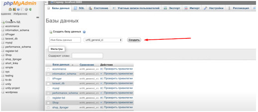
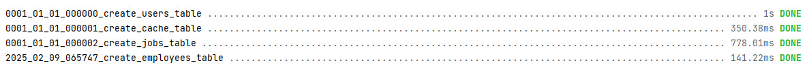
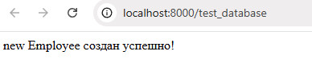
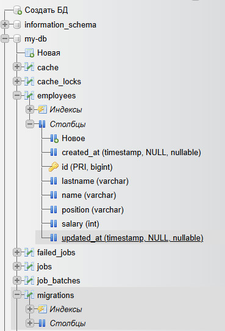
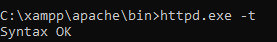

# Продвинутое программирование на PHP — Laravel

## Урок 3. Работа с базами данных. ORM-система Eloquent

### Домашнее задание 

<br><br>
Цели:<br>

Научиться:<br>

— создавать новые базы данных;<br>
— создавать новые таблицы внутри базы данных;<br>
— подключаться к базе данных через Laravel;<br>
— заполнять таблицы необходимыми данными при помощи Eloquent ORM.<br>

Что нужно сделать:<br>

Создайте базу данных, в ней — новую таблицу. <br> 
Заполните поля, после чего сделайте выборку данных по указанным полям:<br>

1. Для создания, просмотра и редактирования баз данных MySQL установите программу <br> 
   PhpMyAdmin по [инструкции](https://www.phpmyadmin.net/). <br>
   Если у вас на компьютере установлен [MAMP](https://www.mamp.info/en/downloads/),
   [WAMP](https://wamp.net/) или [XAMPP](https://www.apachefriends.org/), <br> 
   то PhpMyAdmin тоже должен быть установлен.

2. Создайте базу данных с любым именем в PhpMyAdmin. <br> 
   Больше в нём ничего делать не нужно, остальное выполните в коде проекта.<br><br>
   <br><br>
3. В папке проекта config/database.php настройте файл конфигурации для базы данных. <br> 
   Пример:

```
'mysql' => [
'read' => [
'host' => '192.168.1.1',
],
'write' => [
'host' => '196.168.1.2'
],
'driver' => 'mysql',
'database' => 'database',
'username' => 'root',
'password' => '',
'charset' => 'utf8',
'collation' => 'utf8_unicode_ci',
'prefix' => '',
],
```

4. Создайте проект Laravel с помощью composer, выполнив команду 

```
composer create-project laravel/laravel <имя проекта>.
```
   
5. В корне проекта создайте файл .env и укажите параметры подключения к базе данных. <br> 
    После редактирования файла .env выполните команду 

```
php artisan config:clear
```

6. В папке проекта через командную строку создайте новую модель Employee. <br> 
   Одновременно с этим создайте файл миграции. <br>
   Для этого в команде создания модели можно использовать флаг -m: 
```
php artisan make:model Employee -mfsc
```
   Флаг -mfsc создаст модель, наполнитель, контроллер и файл миграции.

7. С помощью команды php artisan migrate выполните миграции.

8. В файле routes/web.php создайте новый эндпоинт, например test_database:

```
Route::get('/test_database', function () {
//Код внутри колбэка
});
```

9. Внутри функции-колбэка напишите код, который создаст новый экземпляр модели Employee, <br>
   и сохраните его в базу данных с помощью метода save().

10. Запустите локальный сервер Laravel с помощью команды 
```
php artisan serve
```

11. Перейдите по ссылке <адрес вашего локального сервера>/test_database (по
    умолчанию http://localhost:8000/test_database).

12. Используйте phpMyAdmin, чтобы убедиться, что в вашей базе данных создались таблицы employees и migrations, а в таблице employees создалась новая строка, соответствующая экземпляру модели Employee.

13. Сделайте коммит своих изменений с помощью Git и отправьте push в репозиторий.
<br><br>

### Решение задания

<br><br>
1. Установим с официального сайта [XAMPP](https://www.apachefriends.org/). 
2. При необходимости в папку xampp можно в ручную добавить из zip-архива папки: [php](https://www.php.net/) или [php>8.2](https://www.php.net/releases/8.2/ru.php), 
   [apache](https://www.apachelounge.com/download/), [phpMyAdmin](https://www.phpmyadmin.net/).   
3. По умолчанию Apache использует порт 80. Если этот порт занят другим приложением, <br>
   можно изменить порт в файле httpd.conf конфигурации [Apache](https://httpd.apache.org/download.cgi). <br>
   Например, порт для Main Port - 8089, а для SSL Port - 4443.
4. Необходимо проверить подключение PHP в Apache в файле httpd.conf
```
LoadModule php_module "C:/xampp/php/php8apache2_4.dll"
AddType application/x-httpd-php .php
PHPIniDir "C:/xampp/php"

```
5. По умолчанию MySQL использует порт 3306, который можно заменить на порт 3319.
6. Необходимо проверить в файле xampp/phpMyAdmin/config.inc.php, что указаны правильные настройки для порта MySQL
```
$cfg['Servers'][$i]['host'] = '127.0.0.1';
$cfg['Servers'][$i]['port'] = 3319;

```
7. Для запуска XAMPP открываем XAMPP Control Panel и запускаем модули Apache и MySQL.
8. Откроем phpMyAdmin и переходим по адресу http://127.0.0.1:8089/phpmyadmin в браузере.
9. Создадим новую базу данных в phpMyAdmin во вкладке "Databases". <br>
   Можно указать имя новой базы данных, например, my-db, потом нажать "Create".
10. Очищаем и обновляем кэш конфигурации:
```
php artisan config:cache
php artisan config:clear

```
11. Выполняем команду миграции базы данных:
```
& "C:\xampp\php\php.exe" artisan migrate 
```
или
```
php artisan migrate

```
 <br>

Запускаем проект и видим нужную запись в браузере для проверки портов и базы данных

 <br>

Проверяем наличие вновь созданной базы таблиц employees и migrations, а в таблице employees поля с элементами из файла в папке database/migrations



При необходимости в фреймворке Laravel можно откатить все миграции и после автоматически запустить их снова. Команда позволяет быстро воссоздать всю базу данных:

```
& "C:\xampp\php\php.exe" artisan migrate:refresh

```

<br><br>
### Инструкция

<hr>

Чтобы установите Apache как службу, необходимо через  Win + Q открыть командную строку от имени администратора ```cmd``` <br>
Перейти в директорию bin в папке установки Apache, например, ```cd C:\xampp\apache\bin```. <br>
Выполнить команду ``` httpd.exe -k install``` <br>
Запустить Apache, выполнив команду ``` httpd.exe -k start ``` <br>
Проверить работу Apache, в браузер перейти по адресу http://127.0.0.1:8089, должна появиться страница "It works!". <br>
Для остановки Apache нужно использовать команду ``` httpd.exe -k stop ``` <br>
Для перезапуска Apache нужно использовать команду ``` httpd.exe -k restart ``` <br>
Для мягкого перезапуска Apache без разрыва соединений, использовать команду ``` httpd.exe -k graceful ``` <br>
Для проверки ошибки синтаксиса в файле httpd.conf выполнить команду ``` httpd.exe -t ```  <br>
 <br>

<hr>

Если отсутствует файл C:\xampp\phpMyAdmin\config.inc.php, нужно создать для доступа в панель MySQL:
```
<?php
/* phpMyAdmin configuration file */

// Blowfish secret (for cookie-based authentication)
$cfg['blowfish_secret'] = 's3cur3bl0wf1shk3y'; // Укажите любой случайный набор символов длиной 32 символа

// Servers configuration
$i = 0;

// First MySQL server
$i++;
$cfg['Servers'][$i]['auth_type'] = 'cookie'; // Тип аутентификации: cookie, http, или config
$cfg['Servers'][$i]['host'] = '127.0.0.1'; // Хост базы данных
$cfg['Servers'][$i]['port'] = 3319; // Порт MySQL
$cfg['Servers'][$i]['user'] = 'root'; // Пользователь MySQL
$cfg['Servers'][$i]['password'] = ''; // Пароль (оставьте пустым, если его нет)
$cfg['Servers'][$i]['AllowNoPassword'] = true; // Разрешить вход без пароля

// Другое
$cfg['Lang'] = ''; // Автоматический выбор языка

```


Чтобы сгенерировать в файл .env для продолжения строки ```APP_KEY=base64:...``` <br>
с автоматической подстановкой ключа встроенной artisan-командой Laravel для генерации ключа:
```
php artisan key:generate

```
и очищаем кэш
```
php artisan config:cache

```
Команда, определить статус миграции базы данных:
```
php artisan migrate:status
```
![../archives/hw-3-2-migrate.jpg]

Командаы пересоздать таблицу выполняются последовательно по шагам. <br>
- удалить текущую таблицу:

```
php artisan migrate:rollback
```

- перенести изменения обратно:

```
php artisan migrate:fresh
```

Команда migrate:fresh удалит все существующие таблицы и заново применит все миграции для базы данных.


<br><br><hr>
**В качествnbе решения приложить:** <br>
➔ ссылку на репозиторий с домашним заданием <br>
⚹ записать необходимые пояснения к выполненному заданию<hr><br>
**Критерии оценки:**<br>

**Принято:**<br>
• выполнены все пункты работы;<br>
• в работе используются указанные инструменты и соблюдены условия;<br>
• код корректно отформатирован по стандартам программирования на PHP;<br>
• скрипт запускается, выводит различные данные на экран, не вызывает ошибок.<br>

**На доработку:**<br>
работа выполнена не полностью или с ошибками.<br>

**Как отправить работу на проверку:**<br>

Отправьте коммит, содержащий код задания, на ветку master в вашем репозитории и пришлите его URL (URL Merge Request’а)
через форму. Репозиторий должен быть public.

<br><br><br>


<br><br><br>