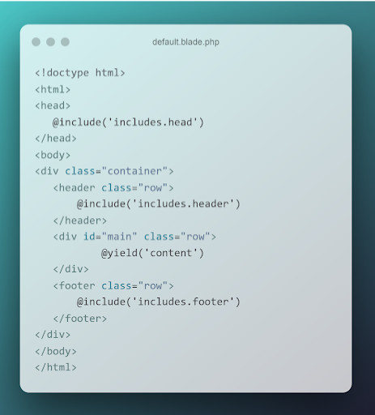
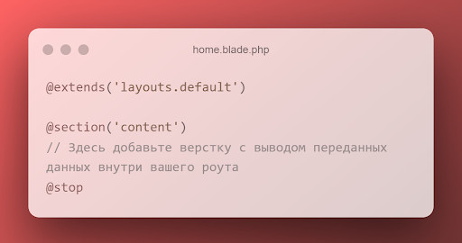

# Продвинутое программирование на PHP — Laravel
## Урок 4. Работа с шаблонами. Шаблонизатор Blade
### Домашнее задание
  
Цели практической работы: 

Научиться: 

• создавать шаблоны blade и переиспользовать их; 
• применять вложенные шаблоны на практике; 
• передавать динамические данные на страницу; 
• использовать директивы. 

Что нужно сделать: 

1. Создайте новый проект Laravel или откройте уже существующий проект, в который хотите добавить шаблоны.

2. Создайте новую ветку вашего репозитория от корневой (main или master).

3. В корневом каталоге проекта создайте подкаталог resources/views. Создайте в нём два шаблона: home.blade.php и contacts.blade.php. Вы заполните эти шаблоны позже.

4. В файле routes/web.php создайте необходимые роуты для навигации по страницам и передачи данных:

— Первый роут — '/', ссылается на корневую страницу проекта. Route::get должен возвращать функцию view. Первым аргументом передайте шаблон home, вторым аргументом — массив данных с ключами name, age, position, address. Значения могут быть произвольными.

— Второй роут — '/contacts'', ссылается на одноимённую страницу с контактами. По аналогии с первым роутом верните из роута функцию view, передайте шаблон contacts и массив с данными — address, post_code, email, phone.

5. В директории views создайте подкаталог layouts, внутри которого поместите шаблон default.blade.php: 

6. Как видно из картинки выше, вам необходимо создать переиспользуемые шаблоны для тегов <head>, <footer> и <hеader>. Для этого в папке views создайте подкаталог includes, а в ней, по аналогии уже с созданными страницами, — три соответствующих шаблона с произвольной вёрсткой и вложенностью.

7. Вернёмся к страницам home и contacts: 

8. Внутри директивы @section добавьте базовую HTML-разметку. Для каждой страницы воспользуйтесь директивой @if. Если значение age для страницы home больше 18 лет, выводите простую цифру, в противном случае — предупреждающее сообщение о том, что указанный человек слишком молод. То же самое повторите и со страницей контактов.
   Если вместо почты в шаблон приходит пустая строка, выведите сообщение:
   «Адрес электронной почты не указан».

9. Сделайте коммит изменений с помощью Git и отправьте push в репозиторий.

**Советы и рекомендации:** 

— При проектировании шаблонов думайте о том, какие участки разметки можно будет переиспользовать позже, вынести в отдельные файлы и компоненты.

  

**В качестве решения приложить:**  
➔ ссылку на репозиторий с домашним заданием  
⚹ записать необходимые пояснения к выполненному заданию
 
**Критерии оценки:** 

**Принято:** 
• выполнены все пункты задания; 
• в работе используются указанные инструменты и соблюдены условия; 
• код корректно отформатирован по стандартам программирования на PHP; 
• скрипт запускается, выводит различные данные на экран, не вызывает ошибок. 

**На доработку:** 
• выполнены не все обязательные пункты задания; 
• задание выполнено с ошибками. 

**Как отправить работу на проверку:** 

Отправьте коммит, содержащий код задания, на ветку master в вашем репозитории и пришлите его URL (URL Merge Request’а) через форму. Репозиторий должен быть public. 
   

   
