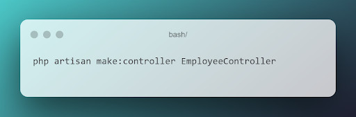
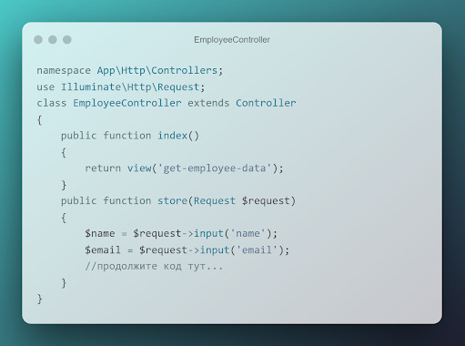
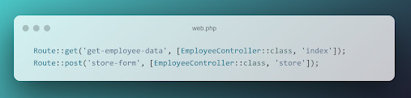
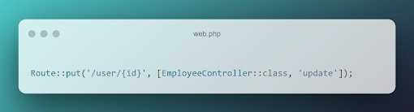
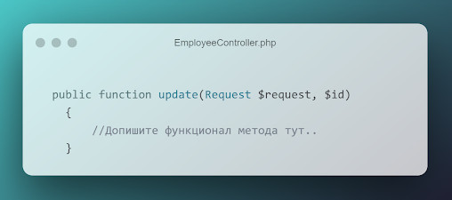
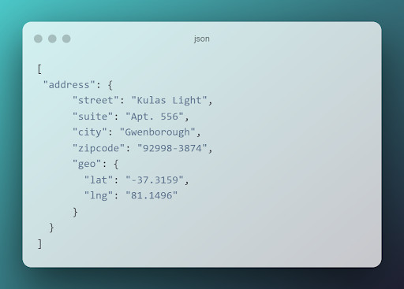
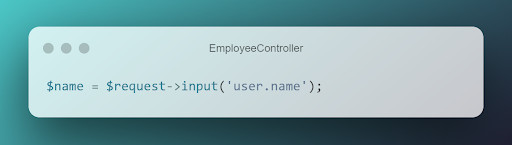
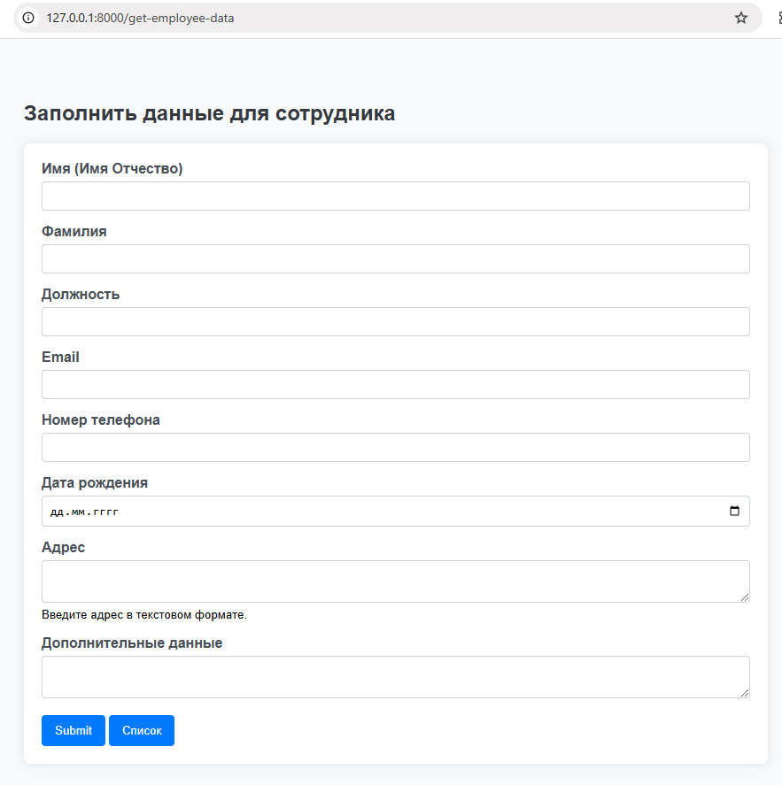
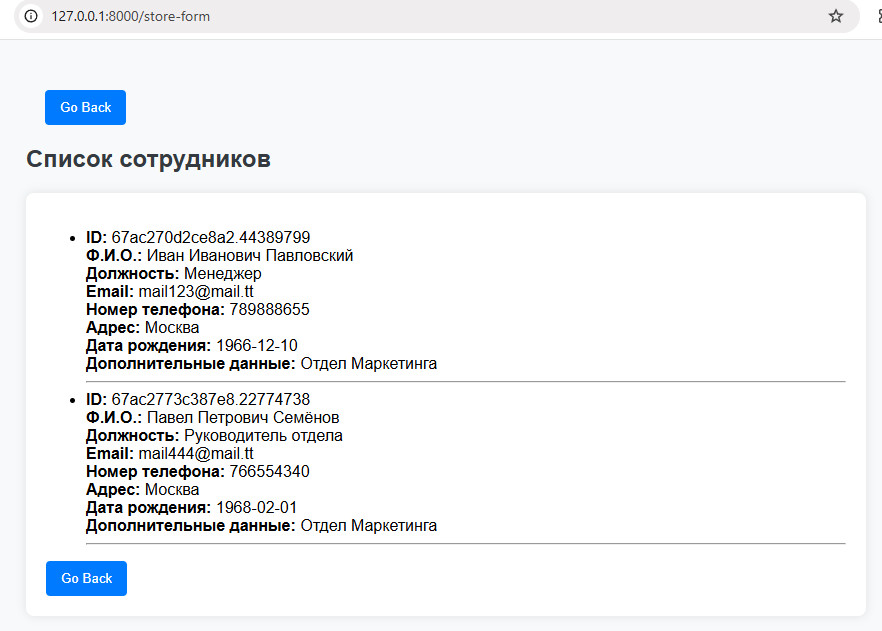

# Продвинутое программирование на PHP — Laravel
## Урок 5. Обработка запроса (Request)
### Домашнее задание
<br><br>
Цели практической работы:

Научиться:

— использовать класс Laravel Request на практике;
— получать параметры запроса из полей ввода и адресной строки;
— передавать данные в формате JSON из полей ввода в класс Laravel Request.

Что нужно сделать:

В этой практической работе вы будете получать данные из формы и обрабатывать их в контроллере с помощью встроенных методов класса Illuminate\Http\Request.

1. В соответствующих каталогах создайте три файла:
   — blade-шаблон для создания пользовательских инпутов;
   — EmployeeController для обработки полученных данных из полей формы;
   — Route для создания динамического роутинга для отдельного работника и передачи параметра id из адресной строки.

2. В blade-шаблоне создайте форму, которая будет отправлять данные о работнике.<br>


```
<form mane="employee-form" id="mployee-forn" method="port" action="{{url('store-form'}}>
@csrf
<div clanse"form-group">
    <label for="name">Name</label>
    <input type="text" id="name" name="name" class="forn-control" required="true">
</div>
<div class="form-group">
    <label for="enail" Description</label>
    <input type="email" id="email" name="email" class="form-control" require="true">
</div>
<div class="form group">
    <label for="workData">workData</1abel>
    <textarea nane="workData" class="form-control" required="true">textarea</textarea> 
</div>
<button type="submit" class="btn btn-primary">Submit</button>
</form>
```

По аналогии с приведённым выше примером создайте ещё несколько полей ввода. Например, поля «Фамилия работника», «Занимаемая должность» и «Адрес проживания». Обратите внимание, что у всех полей формы есть атрибут required=”true”. Это важно для полноты получаемых данных от клиента к серверу.

3. Создайте новый контроллер с названием EmployeeController. Напомним, что создавать контроллер нужно из консоли с помощью команды:<br>


```
php artisan make:controller EmployeeController
```
4. Внутри контроллера создайте функцию store, которая будет инициализировать соответствующие переменные и сохранять в них данные из вашей формы:<br>


```
namespace App\Http\Controllers;
use Illuminate\Http\Request; 
class EmployeeController extends Controller
{
    public function index()
    {
        return view('get-employee-data');
    }
    public function store(Request $request)
    {
        $name Srequest->input("name");
        $email = Srequest->input('email');
        // продолжите код тут..
    }
}
```

Добавьте все необходимые переменные в соответствии с вашими полями. Обратите внимание, что мы также создали функцию index, которая просто возвращает необходимый view.

5. Как и в предыдущих занятиях, создайте необходимые роуты в файле web.php:<br>

```
Route::get('get-employee-data', [EmployeeController::class, 'index'); 
Route::post('store-form', [EmployeeController::class, 'store');
```

6. В файле web.php добавьте ещё один роут с внедрением зависимости параметров запроса в виде id:<br>

```
Route::put('/user/{'id'},[EmployeeController::class,'update']);
```

7. Добавьте соответствующий метод в созданный ранее контроллер:<br>


```
public function opdate(Request $request, $id)
{
    // Допишите функционал метода тут..
}
```
   Добавьте новую переменную id. Поместите в неё id из параметров запроса, обновите данные о пользователе: name, email и так далее.

8. Создайте две новые функции getPath(), getUrl(), в которых необходимо получить и записать в переменную путь и URL запроса. Для этого воспользуйтесь встроенными в класс Request методами $request->path() и $request->url();

Данные методы можно вызывать внутри других методов — update и store, чтобы получать служебную информацию о запросе.

9. В форму ввода добавьте новое текстовое поле textarea, куда необходимо передавать данные в формате JSON, например:<br>

```
[
"address": {
    "street":"Kulas Light",
    "suite":"Apt.556",
    "city":"Gwenborough",
    "zipcode":"92998-3874",
    "geo":{
        "lat":"-37.3159",
        "lng":"81.1496"
        }
    }
]
```

10. Обновите функции store и update. Преобразуйте полученный из запроса JSON в переменную PHP. Для этого воспользуйтесь методом json_decode().

11. Создайте произвольное количество новых php переменных, в которые поместите отдельные поля из пришедших данных в формате JSON. Например:<br>

``` 
$name=$request->input('user.name'); 
```

<br><br>

### Домашнее задание
<br><br>  

1. В папке resources/views создаем файлы шаблонов для страниц:
- get-employee-data.blade.php
- store-form.blade.php
- update-form.blade.php

2. С помощью команды ```php artisan make:controller EmployeeController``` содаем новый контроллер в папке app/Http/Controllers

3. Записываем в содержимое web.php дополнительные маршруты:
```
Route::get('get-employee-data', [EmployeeController::class, 'index']);
Route::post('store-form', [EmployeeController::class, 'store']);
Route::get('store-form', [EmployeeController::class, 'showStoredData']);
Route::put('user/{id}', [EmployeeController::class, 'update']);

```

4. Размещаем файл стилей main.css в директории public/css проекта.
5. Записываем в контроллер код для обработки данных из формы для записи в файл в формате JSON.
6. Страница формы открывается по адресу:
```
http://127.0.0.1:8000/get-employee-data

```
 <br>
7. Страница со списком открывается по адресу:
```
http://127.0.0.1:8000/store-form

```
 <br>

8. Данные сохраняются в файле storage/app/private/employees.json:


<br><br><hr>
**В качестве решения приложить:** <br>
➔ ссылку на репозиторий с домашним заданием <br>
⚹ записать необходимые пояснения к выполненному заданию<hr><br>
**Критерии оценки**<br>
**Принято:**<br>
— выполнены все пункты работы;<br>
— в работе используются указанные инструменты и соблюдены все пункты задания;<br>
— код корректно отформатирован по стандартам программирования на PHP;<br>
— скрипт запускается, выводит различные данные на экран, не вызывает ошибок.<br>

**На доработку:**<br>
работа выполнена не полностью или с ошибками.<br>

**Как отправить работу на проверку:**<br>
Отправьте коммит, содержащий код задания, на ветку master в вашем репозитории и пришлите его URL (URL Merge Request’а) через форму. Репозиторий должен быть public.<br>


<br><br><br>
