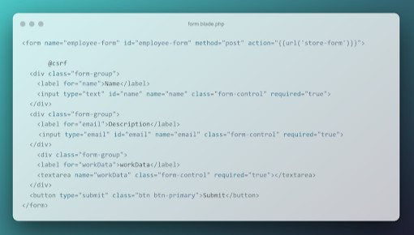
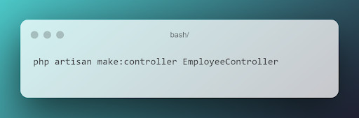
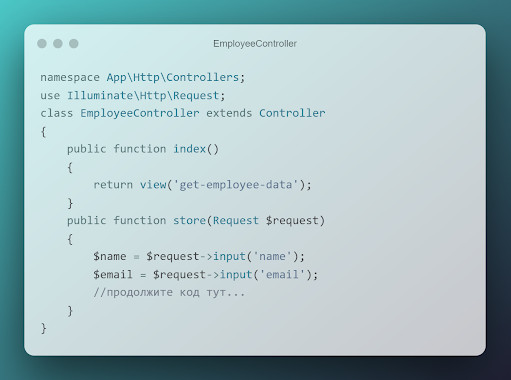
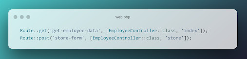
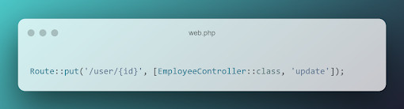
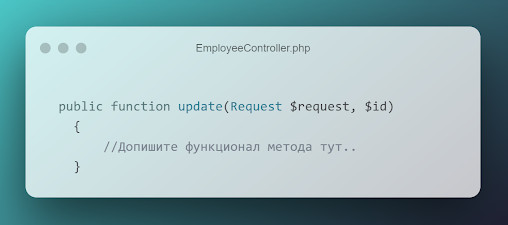
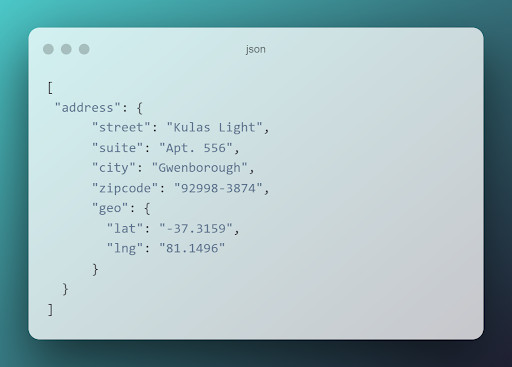

# Продвинутое программирование на PHP — Laravel
## Урок 5. Обработка запроса (Request)
### Домашнее задание
  
Цели практической работы:

Научиться:

— использовать класс Laravel Request на практике;
— получать параметры запроса из полей ввода и адресной строки;
— передавать данные в формате JSON из полей ввода в класс Laravel Request.

Что нужно сделать:

В этой практической работе вы будете получать данные из формы и обрабатывать их в контроллере с помощью встроенных методов класса Illuminate\Http\Request.

1. В соответствующих каталогах создайте три файла:
   — blade-шаблон для создания пользовательских инпутов;
   — EmployeeController для обработки полученных данных из полей формы;
   — Route для создания динамического роутинга для отдельного работника и передачи параметра id из адресной строки.

2. В blade-шаблоне создайте форму, которая будет отправлять данные о работнике. 

По аналогии с приведённым выше примером создайте ещё несколько полей ввода. Например, поля «Фамилия работника», «Занимаемая должность» и «Адрес проживания». Обратите внимание, что у всех полей формы есть атрибут required=”true”. Это важно для полноты получаемых данных от клиента к серверу.

3. Создайте новый контроллер с названием EmployeeController. Напомним, что создавать контроллер нужно из консоли с помощью команды: 

4. Внутри контроллера создайте функцию store, которая будет инициализировать соответствующие переменные и сохранять в них данные из вашей формы: 

Добавьте все необходимые переменные в соответствии с вашими полями. Обратите внимание, что мы также создали функцию index, которая просто возвращает необходимый view.

5. Как и в предыдущих занятиях, создайте необходимые роуты в файле web.php: 

6. В файле web.php добавьте ещё один роут с внедрением зависимости параметров запроса в виде id: 

7. Добавьте соответствующий метод в созданный ранее контроллер: 

   Добавьте новую переменную id. Поместите в неё id из параметров запроса, обновите данные о пользователе: name, email и так далее.

8. Создайте две новые функции getPath(), getUrl(), в которых необходимо получить и записать в переменную путь и URL запроса. Для этого воспользуйтесь встроенными в класс Request методами $request->path() и $request->url();

Данные методы можно вызывать внутри других методов — update и store, чтобы получать служебную информацию о запросе.

9. В форму ввода добавьте новое текстовое поле textarea, куда необходимо передавать данные в формате JSON, например: 

10. Обновите функции store и update. Преобразуйте полученный из запроса JSON в переменную PHP. Для этого воспользуйтесь методом json_decode().

11. Создайте произвольное количество новых php переменных, в которые поместите отдельные поля из пришедших данных в формате JSON. Например: 

    

  

**В качестве решения приложить:**  
➔ ссылку на репозиторий с домашним заданием  
⚹ записать необходимые пояснения к выполненному заданию
 
**Критерии оценки** 
**Принято:** 
— выполнены все пункты работы; 
— в работе используются указанные инструменты и соблюдены все пункты задания; 
— код корректно отформатирован по стандартам программирования на PHP; 
— скрипт запускается, выводит различные данные на экран, не вызывает ошибок. 

**На доработку:** 
работа выполнена не полностью или с ошибками. 

**Как отправить работу на проверку:** 
Отправьте коммит, содержащий код задания, на ветку master в вашем репозитории и пришлите его URL (URL Merge Request’а) через форму. Репозиторий должен быть public. 

   