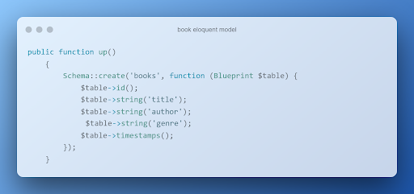
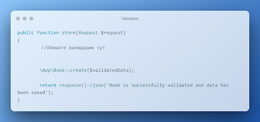
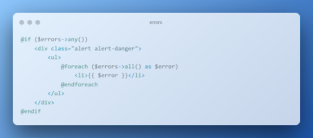

# Вокруг PHP – экосистема веб-приложений. Обучение в записи
## Урок 6. Работа с формами
### Домашнее задание
<br><br>
Цели практической работы:<br>

Научиться:<br>

— связывать данные модели с полями формы;<br>
— обеспечивать безопасность формы с помощью CSRF-токенов;<br>
— валидировать поля формы;<br>
— использовать семантически правильные и релевантные элементы управления формой.<br>

Что нужно сделать:<br>

В этой практической работе вы создадите форму по добавлению новой книги в книжный каталог. Форма будет создаваться внутри шаблона. Данные из формы будут записываться в соответствующие поля базы данных с помощью модели Eloquent.

1. Внутри директории resources/view корневого каталога проекта создайте новый блейд-шаблон с именем form.blade.php.<br>
   Пример формы:<br>

   <br>
```
<diy class="add-books__form-wrapper">
    <form name="add-new-book" id="add-hew-book" nethod="post" action="{{ur1('store-form')}}">
        <div class-"form-section">
            <label for="title">Titlec/label>
            <input type="text" id="title" name="title" class="form control" required>
        </div>
        <div class="form-section">
            <label for="author">Author</label>
            <input type="text" 1d="author" name="author" class="form-control" required>
        </div>
        <div class="form-section">
            <label for="genre">Choose Genre:</label>
            <select name="genre" id="genre">
                <option value="fantasy">Fantasy</option>
                <option value="sci-fi">Sci-Fi</option>
                <option value="mystery">Mystery</option> 
                <option value="drama">Druma</option>
            </select>
        </div>
        <button type="submit" class="btn btn-primary">Submit</button>
    </form>
</d1v>
```
   В примере выше продемонстрирована простая форма для добавления новой записи о книге.<br> 
   В ней указаны поля с названием книги, именем автора, а также жанр, который можно выбрать из списка. Вы также можете добавить произвольные поля, чтобы сделать данные из формы более комплексными и приближенными к реальности.

2. Чтобы защитить данные формы от межсайтовой подделки запроса, добавьте внутрь формы CSRF токен. Напомним, сделать этом можно с помощью директивы @csrf или скрытого поля input:<br>

<br>
```
<form method="POST" action="/profile">
    @csrf
    <! --- Или --- >
    <input type="hidden" nase="_token" value="{{ csnf_token() }}"/> 
</form>
```
3. Свяжите данные полей формы с моделью Laravel. Для этого создайте новую модель. Сделать это можно из командной строки с помощью artisan-команды:<br>
<br>
```
php artisan make:model Book -mfsc
```
Напомним, что флаг -mfsc создаст модель, наполнитель, контроллер и файл миграции.

4. Чтобы данные из формы корректно записывались в соответствующие поля базы данных, опишите схему базы данных в методе up():<br>
<br>
```
public function up()
	{
		Schema::create('books', function (Blueprint $table) {
			$table->1d();
			$table->string('title');
			$table->string('author');
			$table->string('genne');
			$table->timestamps();
	});
}
```
   Чтобы в базе данных появились соответствующие поля, не забудьте повторно запустить миграции в базе данных, воспользовавшись соответствующей командой artisan.

5. Внутри файла /routes/web.php опишите новый роут (метод GET), который будет вызывать метод index контроллера BookController по url /index. Также добавьте роут с методом POST, который будет вызывать метод store того же контроллера BookController с url** /store**

6. Опишите метод index внутри контроллера BookController. Метод должен возвращать представление формы в браузере.

7. Опишите метод store(). Прежде чем сохранить данные внутри модели, проведите валидацию с помощью метода $request->validate(). <br>Правила для валидации:<br>
   — все поля обязательны к заполнению, без пустых строк и пробелов в качестве единственного значения;<br>
   — максимальное число символов в имени автора — 100, в названии книги — 255;<br>
   — название книги должно быть уникальным значением в моделе Book.<br>

```
public function store(Request $request)
{
    //Опишите валидацию тут ...
    
    \App\Book::create(ValidatedData);
    return response()->json('Book is successtully validated and data has been saved');
}
```
8. Добавьте обработку ошибок при некорректной валидации.<br>
<br>
```
@lf($errors->any())
       <div class="alert alert-danger">
        <ul>
            @foreach ($errors->all() as $error)
                <li>[( $errors ))</li>
            @endforeach
        </ul>
    </divs
@endiF
```

<br><br>

### Решение задания

1. composer create-project laravel/laravel php-form
2. cd php-form
3. Подключаем и запускаем [XAMPP](https://www.apachefriends.org/). 
4. Проверяем работу нового проекта командой:
```
php artisan serve
```
5. Останавливаем сервер laravel с проектом, выполнив нажатие клавиш "Ctrl + C".
6. Подключаем репозиторий:
```
git init
git add .
git commit -m "first commit"
git remote add origin https://github.com/stanislavfor/php-form.git
git push -u origin master

```
7. Настраиваем базу данных в файле config/database.php и аналогично в файле .env
```
APP_NAME=Php-form
APP_ENV=local
APP_DEBUG=true

APP_URL=http://localhost:8089
DB_CONNECTION=mysql
DB_HOST=127.0.0.1:8089
DB_PORT=3319
DB_DATABASE=php-form
DB_USERNAME=root
DB_PASSWORD=''

```
8. Удаляем кэш командой
```
php artisan config:clear
```
 <br>

9. Добавляем новую базу данных 'php-form' в [phpMyAdmin](http://localhost:8089/phpmyadmin/).
10. Внутри директории resources/view корневого каталога проекта создаем blade-шаблон form.blade.php для описания книг.
11. Добавляем механизм защиты от CSRF на форму в коде после открывающего тэга '<form>' указываем '@csrf'.
12. Создаем новую модель и связываем данные полей формы с моделью Book. Для этого используем команду:
```
php artisan make:model Book -mfsc
```
Команда php artisan make:model Book -mfsc в проекте Laravel создает несколько файлов для модели Book:
- app/Models/Book.php;
- database/migrations/xxxx_xx_xx_create_books_table.php;
- database/factories/BookFactory.php;
- database/seeders/BookSeeder.php;
- app/Http/Controllers/BookController.php.
13. В контроллере (класс BookController) записываем методы для обработки запросов формы на добавление новой книги, валидации данных.
14. В файле миграции создаем таблицу books с необходимыми полями для базы данных.
15. Для миграции таблиц базы данных запускаем в терминале команду:
```
php artisan migrate
```
16. Добавляем маршруты роут для отображения формы и роут для обработки отправки формы в файле routes/web.php:
```
use App\Http\Controllers\BookController;

Route::get('/index', [BookController::class, 'index'])->name('books.index');
Route::post('/store', [BookController::class, 'store'])->name('books.store');

```

17. Открываем страницу в браузере полей формы для добавления книг: http://127.0.0.1:8000/index
18. Открываем страницу в браузере списка книг, получаемого из базы данных: http://127.0.0.1:8000/books <br>
Адрес, указанный в роутере как '/store', не открывается в браузере, так как используется для отправки данных формы на сервер и базу данных.


<br><br><hr>
**В качестве решения приложить:** <br>
➔ ссылку на репозиторий с домашним заданием <br>
⚹ записать необходимые пояснения к выполненному заданию<hr><br>

**Критерии оценки:** <br>

**Принято:** <br>
— выполнены все пункты работы; <br>
— все значения из полей формы приходят и обрабатываются в контроллере, сохраняются в базе; <br>
— поля корректно валидируются согласно требованиям; <br>
— при некорректной валидации на странице пользователю выводится информация об ошибках; <br>
— код корректно отформатирован по стандартам программирования на PHP; <br>
— код корректно отформатирован по стандартам программирования на PHP; <br>
— скрипт запускается, выводит различные данные на экран, не вызывает ошибок.

— код корректно отформатирован по стандартам программирования на PHP; <br>
**На доработку: **
— код корректно отформатирован по стандартам программирования на PHP; <br>
работа выполнена не полностью или с ошибками.

— код корректно отформатирован по стандартам программирования на PHP; <br>
**Как отправить работу на проверку:**

— код корректно отформатирован по стандартам программирования на PHP; <br>
Отправьте коммит, содержащий код задания, на ветку master в вашем репозитории и пришлите его URL (URL Merge Request’а) через форму. Репозиторий должен быть public.


<br><br><br>
