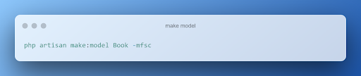

# Вокруг PHP – экосистема веб-приложений. Обучение в записи
## Урок 6. Работа с формами
### Домашнее задание
  
Цели практической работы: 

Научиться: 

— связывать данные модели с полями формы; 
— обеспечивать безопасность формы с помощью CSRF-токенов; 
— валидировать поля формы; 
— использовать семантически правильные и релевантные элементы управления формой. 

Что нужно сделать: 

В этой практической работе вы создадите форму по добавлению новой книги в книжный каталог. Форма будет создаваться внутри шаблона. Данные из формы будут записываться в соответствующие поля базы данных с помощью модели Eloquent.

1. Внутри директории resources/view корневого каталога проекта создайте новый блейд-шаблон с именем form.blade.php. 
   Пример формы: 

    
   В примере выше продемонстрирована простая форма для добавления новой записи о книге.  
2. В ней указаны поля с названием книги, именем автора, а также жанр, который можно выбрать из списка. Вы также можете добавить произвольные поля, чтобы сделать данные из формы более комплексными и приближенными к реальности.

2. Чтобы защитить данные формы от межсайтовой подделки запроса, добавьте внутрь формы CSRF токен. Напомним, сделать этом можно с помощью директивы @csrf или скрытого поля input: 

 
Свяжите данные полей формы с моделью Laravel. Для этого создайте новую модель. Сделать это можно из командной строки с помощью artisan-команды: 
 
Напомним, что флаг -mfsc создаст модель, наполнитель, контроллер и файл миграции.

4. Чтобы данные из формы корректно записывались в соответствующие поля базы данных, опишите схему базы данных в методе up(): 
 
   Чтобы в базе данных появились соответствующие поля, не забудьте повторно запустить миграции в базе данных, воспользовавшись соответствующей командой artisan.

5. Внутри файла /routes/web.php опишите новый роут (метод GET), который будет вызывать метод index контроллера BookController по url /index. Также добавьте роут с методом POST, который будет вызывать метод store того же контроллера BookController с url** /store**

6. Опишите метод index внутри контроллера BookController. Метод должен возвращать представление формы в браузере.

7. Опишите метод store(). Прежде чем сохранить данные внутри модели, проведите валидацию с помощью метода $request->validate().  Правила для валидации: 
   — все поля обязательны к заполнению, без пустых строк и пробелов в качестве единственного значения; 
   — максимальное число символов в имени автора — 100, в названии книги — 255; 
   — название книги должно быть уникальным значением в моделе Book. 

8. Добавьте обработку ошибок при некорректной валидации. 
 

  

**В качестве решения приложить:**  
➔ ссылку на репозиторий с домашним заданием  
⚹ записать необходимые пояснения к выполненному заданию
 

**Критерии оценки:**  

**Принято:**  
— выполнены все пункты работы;  
— все значения из полей формы приходят и обрабатываются в контроллере, сохраняются в базе;  
— поля корректно валидируются согласно требованиям;  
— при некорректной валидации на странице пользователю выводится информация об ошибках;  
— код корректно отформатирован по стандартам программирования на PHP;  
— код корректно отформатирован по стандартам программирования на PHP;  
— скрипт запускается, выводит различные данные на экран, не вызывает ошибок.

— код корректно отформатирован по стандартам программирования на PHP;  
**На доработку: **
— код корректно отформатирован по стандартам программирования на PHP;  
работа выполнена не полностью или с ошибками.

— код корректно отформатирован по стандартам программирования на PHP;  
**Как отправить работу на проверку:**

— код корректно отформатирован по стандартам программирования на PHP;  
Отправьте коммит, содержащий код задания, на ветку master в вашем репозитории и пришлите его URL (URL Merge Request’а) через форму. Репозиторий должен быть public.

   