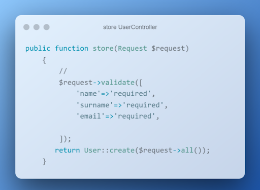

# Продвинутое программирование на PHP — Laravel
## Урок 7. Формирование ответа (Response)
### Домашнее задание
  
Цели практической работы:

Научиться:

— использовать класс Laravel Response на практике;
— создавать CRUD REST API на базе фреймворка Laravel;
— передавать данные в формате PDF в ответе экземпляра класса Response.

Что нужно сделать:

В этой практической работе вы будете разрабатывать контроллер, который позволит выводить информацию об одном и обо всех пользователях из базы данных, сохранять данные о новом пользователе в БД, а также создавать PDF с информацией о пользователе.
1. Установите новое приложение Laravel и настройте подключение к базе данных. Напомним, что создать новое приложение можно с помощью команды composer:

composer create-project laravel/laravel crud

Добавьте необходимые переменные окружения в ENV-файл корневого каталога приложения. 

2. Создайте новую модель Eloquent c помощью команды:

php artisan make:model User -mfsc

Напомним, что флаг -mfsc создаст модель, наполнитель, контроллер и файл миграции.
После опишите схему базы данных в методе up() файла .app/Http/Models/User.php. 

После описания схемы таблицы базы данных запустите миграцию. 

3. Создайте необходимые роуты в файле web.php. Ваше приложение должно содержать минимум четыре эндпоинта: 
   — для получения всех пользователей из БД; 
   — получения одного пользователя через id, переданный в параметрах роута; 
   — записи нового пользователя в базу данных; 
   — получения данных о пользователе в виде PDF-файла. 

4. Создайте новый blade-шаблон. В blade-шаблоне создайте форму, которая будет отправлять данные о работнике. Важно, чтобы поля HTML-формы были сопоставимы с полями таблицы базы данных. При отправке запроса экземпляр класса request должен содержать данные об имени, фамилии и адресе электронной почты пользователя.
   Форма blade-шаблона должна содержать CSRF-токен, поля формы должны быть обязательны к заполнению (используйте атрибут required).

5. В контроллере UserController.php опишите функцию store, которая будет сохранять данные из вашей HTML-формы. Добавьте валидацию. 
   
   Дополнительно. Добавьте валидацию на количество символов (максимальное количество символов — 50) для полей Name и Surname. Для почты добавьте валидацию в виде регулярного выражения на соответствие виду example@mail.com. 
   
6. Добавьте соответствующие методы index и get, которые будут возвращать данные обо всех пользователях и об одном пользователе по переданному id. Опционально можете возвращать ответ в формате JSON.

7. Чтобы генерировать PDF-документ, вам понадобится DOMPDF-пакет, который является сторонней библиотекой. Для его установки выполните команду:

composer require barryvdh/laravel-dompdf

— В файле composer.json добавьте строку с указанным пакетом. 
— Запустите команду composer update. 
— Добавьте необходимый Service Provider и Facade в файл config/app.php. 

8. Создайте новый контроллер для работы с PDF:

php artisan make:controller PdfGeneratorController

9. Опишите функцию index, которая будет возвращать новый PDF-файл. 
   
10. Измените роут Route::get(‘/resume’) таким образом, чтобы он принимал id в виде параметра. Обновите функцию «index» так, чтобы PDF формировался на основе данных из таблицы по переданному id.

  

**В качестве решения приложить:**  
➔ ссылку на репозиторий с домашним заданием  
⚹ записать необходимые пояснения к выполненному заданию  

**Критерии оценки**
**Принято: ** 

— Выполнены все основные пункты работы. 
— Поля формы корректно валидируются на стороне клиента и сервера. 
— Форма содержит CSRF-токен. 
— Написанное API позволяет сохранять и получать данные о пользователе, получать данные обо всех пользователях и генерировать PDF-документ. 
— Скрипт запускается, выводит различные данные на экран, не вызывает ошибок. 

**На доработку: ** 
работа выполнена не полностью или с ошибками. 

**Как отправить работу на проверку:**

Отправьте коммит, содержащий код задания, на ветку master в вашем репозитории и пришлите его URL (URL Merge Request’а) через форму. Репозиторий должен быть public. 

   