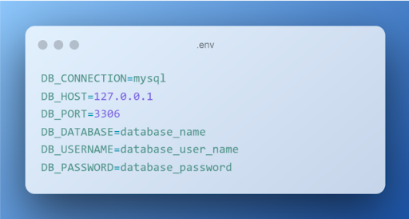

# Продвинутое программирование на PHP — Laravel
## Урок 7. Формирование ответа (Response)
### Домашнее задание
<br><br>

#### Цели практической работы:<br>

#### Научиться:<br>

— использовать класс Laravel Response на практике;<br>
— создавать CRUD REST API на базе фреймворка Laravel;<br>
— передавать данные в формате PDF в ответе экземпляра класса Response.<br>

##### Что нужно сделать:<br>

В этой практической работе вы будете разрабатывать контроллер, который позволит выводить информацию об одном и обо всех пользователях из базы данных, сохранять данные о новом пользователе в БД, а также создавать PDF с информацией о пользователе.
1. Установите новое приложение Laravel и настройте подключение к базе данных. Напомним, что создать новое приложение можно с помощью команды composer:

composer create-project laravel/laravel crud

Добавьте необходимые переменные окружения в ENV-файл (.env) корневого каталога приложения.<br>

```

DB_CONNECTION=mysql
DB_HOST=127.0.0.1
DB_PORT=3306
DB_DATABASE=database_name
DB_USERNAME=database_user_name
DB_PASSWORD=database_password

```
2. Создайте новую модель Eloquent c помощью команды:

php artisan make:model User -mfsc

Напомним, что флаг -mfsc создаст модель, наполнитель, контроллер и файл миграции.
После опишите схему базы данных в методе up() файла .app/Http/Models/User.php.<br>

```
$table->id();
$table->string('name');
$table->string('surname');
$table->string('email');
$table->timestamps();

```
После описания схемы таблицы базы данных запустите миграцию.<br>

3. Создайте необходимые роуты в файле web.php. Ваше приложение должно содержать минимум четыре эндпоинта:<br>
   — для получения всех пользователей из БД;<br>
   — получения одного пользователя через id, переданный в параметрах роута;<br>
   — записи нового пользователя в базу данных;<br>
   — получения данных о пользователе в виде PDF-файла.<br>

```
Route::get('/user', [UserController::class, 'index']); 
Route::get('/user/[id)", [UserController::class, 'get']); 
Route::post('/store-user', [UserController::class, 'store'1); 
Route::get('/resume', [PdfGeneratorController::class, 'index']);

```
4. Создайте новый blade-шаблон. В blade-шаблоне создайте форму, которая будет отправлять данные о работнике. Важно, чтобы поля HTML-формы были сопоставимы с полями таблицы базы данных. При отправке запроса экземпляр класса request должен содержать данные об имени, фамилии и адресе электронной почты пользователя.
   Форма blade-шаблона должна содержать CSRF-токен, поля формы должны быть обязательны к заполнению (используйте атрибут required).

5. В контроллере UserController.php опишите функцию store, которая будет сохранять данные из вашей HTML-формы. Добавьте валидацию.<br>
   
```
public function store(Request Srequest)
   {
      //
      $request->validate([
         'name'=>'required',
         'surname'=>'required',
         'email'=>'required',
      ]);
      return User::create($request->all());
   }
```
   *Дополнительно*. Добавьте валидацию на количество символов (максимальное количество символов — 50) для полей Name и Surname. Для почты добавьте валидацию в виде регулярного выражения на соответствие виду '''example@mail.com'''.<br>
   
```
public function index(){ 
   return User::all();
}

public function get(Request $request, $id){ 
   $user = User::where('id',$id)->first(); 
   return $user;
}
```
6. Добавьте соответствующие методы index и get, которые будут возвращать данные обо всех пользователях и об одном пользователе по переданному id. Опционально можете возвращать ответ в формате JSON.

7. Чтобы генерировать PDF-документ, вам понадобится DOMPDF-пакет, который является сторонней библиотекой. Для его установки выполните команду:

composer require barryvdh/laravel-dompdf

— В файле composer.json добавьте строку с указанным пакетом.<br>
— Запустите команду composer update.<br>
— Добавьте необходимый Service Provider и Facade в файл config/app.php.<br>

```
[
'providers' => [
   /*
   *Laravel Framework Service Providers ...
   */
   /*
   * Application Service Providers ...
   */
   Barryvdh\DomPDF\ServiceProvider::class, //Add this code
 ],
'aliases' => [
   'PDF' => Barryvdh\DomPDF\Facade::class, //Add this code
   ],
 ]
```
8. Создайте новый контроллер для работы с PDF:

php artisan make:controller PdfGeneratorController

9. Опишите в /app/Http/Controllers/PdfGeneratorCantroller.php функцию index, которая будет возвращать новый PDF-файл.<br>
   
```
<?php
namespace App\Http\Controllers;

use Illuminate\Http\Request; 
use PDF;

class PdfGeneratorController extends Controller
{
   public function index()
   {
      $data = [
         'name' =>'John',
         'surname' => 'Doe',
         'email' => 'john.doe@email.com'
      ];
      $pdf = PDF::IoadView('resume', $data); 
      return $pdf->stream('resume.pdf');
   }
}

```
10. Измените роут Route::get(‘/resume’) таким образом, чтобы он принимал id в виде параметра. Обновите функцию «index» так, чтобы PDF формировался на основе данных из таблицы по переданному id.

<br><br>

### Домашнее задание

1. ```composer create-project laravel/laravel crud-project```
2. Создаем базу данных crud-project в phpmyadmin
3. Переходим в проект ``` cd crud-project ```
4. Добавляем настройки новой базы данных для проекта в .env и config/database.php
5. ```php artisan make:model ProjectUser -mfsc```
6. Указываем схему базы данных в методе up() файла миграции
7. После описания схемы таблицы базы данных запускаем миграцию:
```
php artisan migrate
```

8. Создаем контроллер ProjectUserController.php
```
php artisan make:controller PdfGeneratorController

```
9. Добавляем маршруты в файл web.php:
```
use App\Http\Controllers\ProjectUserController;
use App\Http\Controllers\PdfGeneratorController;

Route::get('/users', [ProjectUserController::class, 'index']);
Route::get('/user/{id}', [ProjectUserController::class, 'get']);
Route::post('/store-user', [ProjectUserController::class, 'store']);
Route::get('/user/{id}/pdf', [PdfGeneratorController::class, 'generatePdf']);

```
10. Добавляем шаблон blade resources/views/user_form.blade.php

11. Устанавливаем DOMPDF, выполнив команду:
```
composer require barryvdh/laravel-dompdf

```


12. Добавляем в "require" файла composer.json с указанием пакета запись:
```
"barryvdh/laravel-dompdf": "^3.1",
```
    

13. Запускаем команду 
``` 
composer update 
```


14. Настраиваем контроллер PdfGeneratorController.php, добавляем метод для генерации PDF
15. Настраиваем ProjectUserController.php
16. Добавляем Service Provider и Facade в файл config/app.php
```
 'providers' => [
        // ...
        Barryvdh\DomPDF\ServiceProvider::class,
    ],
    'aliases' => [
        // ...
        'PDF' => Barryvdh\DomPDF\Facade::class,
    ],
```
17. Главная страница открывается на адресе ```http://localhost:8000``` по команде:
```
php artisan serve

```
18. Для добавления нового пользователя открыть http://localhost:8000/user_form в браузере.
 <br>
После заполнения формы данные будут отправлены по адресу ``` http://localhost:8000/store-user ``` для базы данных.
19. Для получения всех пользователей в формате JSON перейти по адресу http://localhost:8000/users

20. Для получения данных пользователя по ID, перейти по адресу http://localhost:8000/user/{id}, заменив {id} на идентификатор требуемого пользователя.

21. Для генерации PDF перейти по адресу http://localhost:8000/user/{id}/pdf, заменив {id} на идентификатор пользователя, чтобы сгенерировать PDF с данными пользователя.
 ```   
http://localhost:8000/user_form // - добавляем пользователя
http://localhost:8000/user // - список пользователей
http://localhost:8000/user/{id} // - информация о пользователе
http://localhost:8000/user/{id}/pdf // - скачивание PDF
```

<br><br><hr>

### Инструкция

<br>

#### Работа со ссылками

В Laravel обычно требуется, чтобы папки storage и bootstrap/cache были доступны для записи. Изменить права доступа с помощью следующих команд:

```
chmod -R 775 storage
chmod -R 775 bootstrap/cache

```

Определить, что символическая ссылка на папку storage создана правильно, можно с помощью команды:

```
php artisan storage:link

```
<br><br>

#### Работа с Composer

Для удаления каталога vendor в PowerShell использовать команду
```
Remove-Item -Recurse -Force ./vendor
```
Для удаления файла composer.lock в PowerShell использовать команду
```
Remove-Item -Recurse -Force composer.lock
```

Очистка кеша Composer перед установкой composer
```
composer clear-cache

```

Если папка vendor отсутствует или не читается, нужно установить зависимости Composer, выполнив следующую команду в корневой директории проекта:

```
composer install

```

Обновление Composer до последней версии
```
composer self-update

```

Периодически требуется удалять кэш конфигураций. Команды очистить кэш:

```
php artisan config:cache
php artisan cache:clear
php artisan view:cache
php artisan route:cache

```
<br><br>

#### Переустановка Laravel

Этот шаг создаст новый проект Laravel с последними версиями всех зависимостей и полностью переустановит Laravel:
```php
composer create-project laravel/laravel crud-task-project --prefer-dist

```
<br><br>

#### Миграция
Если таблица в базе данных была неправильно создана или отсутствует, пересоздать таблицу нужно с помощью миграции, запустив команду для создания новой миграции
```php 
artisan make:migration create_project_users_table --create=project_users

```
Следует сразу проверить в файле миграции в папке /database/migrations/xxxx_create_project_users_table.php наличие нужных сущностей в таблице базы данных, добавить требуемые данные
```
public function up()
{
    Schema::create('project_users', function (Blueprint $table) {
        $table->id();
        $table->string('name');
        $table->string('surname');
        $table->string('email')->unique();
        $table->timestamps();
    });
}

public function down()
{
    Schema::dropIfExists('project_users');
}
```
а затем выполнить миграцию командой 
```php
php artisan migrate
```
Далее произвести очистку кеша конфигурации
```php
php artisan config:cache

```

<br><br>

#### Установка DOMPDF-пакета

Для установки пакета `dompdf` в Laravel-проекте через Composer необходимо использовать следующую команду:

```
composer require dompdf/dompdf
```

Эта команда установит последнюю доступную версию библиотеки `dompdf`.<br> Если есть конкретные требования к версии, можно указать номер версии после имени пакета, например:

```
composer require dompdf/dompdf:"^1.0"
```

После выполнения команды пакет будет установлен, а необходимые зависимости добавлены в файл `composer.json`.

Также требуется убедиться, что настроен автозагрузчик Composer, добавив следующий код в проект. Это позволит использовать в приложении все установленные пакеты

```php
require_once __DIR__ . '/vendor/autoload.php';
```

Для интеграции dompdf в Laravel необходимо создать новый сервис-провайдер с помощью Artisan-команды:
```php
php artisan make:provider DomPdfServiceProvider

```
Далее открыть созданный файл DomPdfServiceProvider.php и добавить код
```php
<?php

namespace App\Providers;

use Illuminate\Support\ServiceProvider;
use Dompdf\Dompdf;

class DomPdfServiceProvider extends ServiceProvider
{
    public function register()
    {
        $this->app->singleton('dompdf.wrapper', function () {
            return new Dompdf();
        });
    }

    public function boot()
    {
        //
    }
}

```
Следующим действием требуется зарегистрировать новый сервис-провайдер в файле ```config/app.php``` , добавить его в массив providers:
```

'providers' => [
// Other Service Providers

    App\Providers\DomPdfServiceProvider::class,
],
```
Теперь можно использовать dompdf в контроллере, обновив PdfGeneratorController.php
Выполнить команду ```composer dump-autoload```, чтобы обновить автозагрузку классов и пакетов Laravel, потом применить очистку ```php artisan config:cache```.


<br><br><hr>
**В качестве решения приложить:** <br>
➔ ссылку на репозиторий с домашним заданием <br>
⚹ записать необходимые пояснения к выполненному заданию<br><br>

**Критерии оценки**
**Принято: **<br>

— Выполнены все основные пункты работы.<br>
— Поля формы корректно валидируются на стороне клиента и сервера.<br>
— Форма содержит CSRF-токен.<br>
— Написанное API позволяет сохранять и получать данные о пользователе, получать данные обо всех пользователях и генерировать PDF-документ.<br>
— Скрипт запускается, выводит различные данные на экран, не вызывает ошибок.<br>

**На доработку: **<br>
работа выполнена не полностью или с ошибками.<br>

**Как отправить работу на проверку:**

Отправьте коммит, содержащий код задания, на ветку master в вашем репозитории и пришлите его URL (URL Merge Request’а) через форму. Репозиторий должен быть public.<br>


<br><br><br>