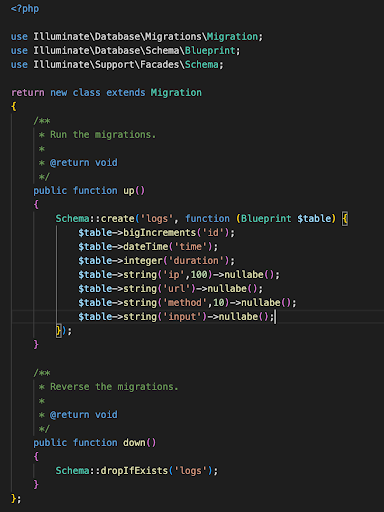
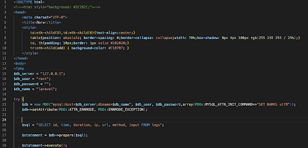

# Продвинутое программирование на PHP — Laravel
## Урок 8. Сервисы: создание и использование
### Домашнее задание
<br><br>
Цели практической работы:<br>

Научиться:<br>

— создавать свои сервисы на Laravel;<br>
— работать с логами Laravel и их обработкой.<br>

Что нужно сделать:<br>

В этой практической работе вы разработаете сервис логирования, который:<br>
— фиксирует обращения к сайту;<br>
— собирает их в базе данных с возможностью отключения системы логирования;<br>
— отражает в реальном времени HTTP-запросы к приложению.<br>

Создадим новый проект:<br>

composer create-project laravel/laravel log-service

1. Для начала создадим модель логов. Для создания модели необходимо использовать artisan с параметром make:model.<br>
   В итоге наша команда будет выглядеть так:<br>

php artisan make:model Log

По умолчанию модель создаётся в ./app/Models/Log.php.<br>
Модель создана, для избежания ошибок запросов SQL необходимо отключить автоматические метки времени.<br>
<br>
```php
<?php
namespace App\Models;
use Illuminate\Database Eloquent\Model;

class Log extends Model
{
    public $timestamps = false;
}
```
2. Теперь опишем миграцию для создания нашей таблицы логов:<br>
```
php artisan make:migration create_logs_table
```
Напомним, что таблицы миграции создаются по умолчанию в /database/migration/current_date_time_create_logs_table.php.<br>

По умолчанию создаётся файл, содержимое которого выглядит так:<br>
<br>
```php
<?php
use Illuminate\Database\Migrations\Migration; 
use Illuminate\Database\Schema\Blueprint;
use Illuminate\Support\Facades\Schema;

return new class extends Migration
{
/**
Run the migrations.
@return void
*/
   public function up()
   {
      Schema:: create('logs', function (Blueprint $table) { $table->id();
        $table->timestamps();
      });
   }
/**
*
Reverse the migrations.
* @return void
*/

   public function down()
   {
       Schema::dropIfExists('logs');
   }
};
```
В этом файле нам нужно определить поля, которые будет собирать наш сервис логирования:<br>
— time — время события;<br>
— duration — длительность;<br>
— IP — IP-адрес зашедшего пользователя;<br>
— url — адрес, который запросил пользователь;<br>
— method — HTTP-метод (GET, POST);<br>
— input — передаваемые параметры.<br>

В итоге файл должен приобрести такой вид:<br>
<br>
```php
<7php
use Illuminate\Database\Migrations\Migration; 
use Illuminate\Database\Schema\Blueprint; 
use Illuminate\Support\Facades\Schema;

return new class extends Migration
{
/**
* Run the migrations.
*
* @return void
*/
   public function up()
   {
      Schema::create('logs', function (Blueprint Stable) {
         Stable->bigIncrements('id');
         Stable->dateTime('time');
         $table->integer('duration'); 
         $table->string('ip',100)->nullabe(); 
         Stable->string('url')->nullabe(); 
         Stable->string('method',,10) ->nullabe();
         $table->string('input')->nullabe();
      });
   }
/**
* Reverse the migrations.
* @return void
*/
   public function down()
   {
       Schema: :dropIfExists('logs');
   }
};
```


3. Миграция создана, параметры описаны. Теперь создадим таблицу.<br>

Напоминаем, что таблица создаётся также через artisan c параметром migrate php artisan migrate.

4. База данных подготовлена, теперь нужно создать звено (middleware) для обработки HTTP-запросов. Напоминаем, что звенья создаются при помощи команды php artisan make:middleware название модели.

В нашем случае нам нужна команда:<br>
php artisan make:middleware DataLogger

По умолчанию звено (посредник) создастся по пути ./app/Http/Middleware/DataLogger.php.<br>
Теперь необходимо настроить middleware. Открываем Datalogger.php. Добавим использование созданной модели.<br>
<br>
```php
<?php

namespace App\Http\Middleware;

use Closure;
use App\Models\Log;
use Illuminate\Http\Request;

class DataLogger
{
    private $start_time;

    /**
     * Handle an incoming request.
     *
     * @param  \Illuminate\Http\Request  $request
     * @param  \Closure  $next
     * @return mixed
     */
    public function handle(Request $request, Closure $next)
    {
        $this->start_time = microtime(true);
        return $next($request);
    }

    /**
     * Perform action after the response has been sent to the browser.
     *
     * @param  \Illuminate\Http\Request  $request
     * @param  \Illuminate\Http\Response  $response
     * @return void
     */
    public function terminate(Request $request, $response)
    {
        if (env("API_DATALOGGER", true)) {
            if (env("API_DATALOGGER_USE_DB", true)) {
                $endTime = microtime(true);
                $log = new Log();
                $log->time = gmdate('Y-m-d H:i:s');
                $log->duration = number_format($endTime - $this->start_time, 3);
                $log->ip = $request->ip();
                $log->url = $request->fullUrl();
                $log->method = $request->method();
                $log->input = $request->getContent();
                $log->save(); // Сохраняли в базу нашу запись
            } else { // На всякий случей, если спция звлиси в БД-недоступна, лезем в файл 
                $endTime = microtime(true);
                $logData = [
                    'time' => gmdate('Y-m-d H:i:s'),
                    'duration' => number_format($endTime - $this->start_time, 3),
                    'ip' => $request->ip(),
                    'url' => $request->fullUrl(),
                    'method' => $request->method(),
                    'input' => $request->getContent(),
                ];                
                file_put_contents(storage_path('logs/api_requests.log'), json_encode($logData) . PHP_EOL, FILE_APPEND);
            }
        }
    }
}

```

Также нужно завершить создание middleware DataLogger, зарегистрировать его в ./app/Http/Kernel.php.<br>
<br>
```php
protected $middleware = [
\App\Http\Middleware\TrustHosts::class,
\App\Http\Middleware\TrustProxies::class,
\Illuminate\Http\Middleware\HandleCors::class, 
\App\Http\Middleware\PreventRequestsDuringMaintenance::class, \Illuminate\Foundation\Http\Middleware\ValidatePostSize::class, 
\App\Http\Middleware\TrimStrings:: class, 
\Illuminate\Foundation\Http\Middleware\ConvertEmptyStringsToNull::class,
\App\Http\Middleware\DataLogger::class,
];

```


5. Модель создана, посредник HTTP-запросов настроен и зарегистрирован как класс в Kernel.php. Если сейчас запустить Laravel командой php artisan serv, всё будет работать. Логи будут записываться в базу данных.<br>
Но увидеть это можно только в самой базе SQL. Для получения более наглядных результатов необходимо создать в web.php эндпоинт.
<br>

```php
Route::get('/logs', function() { 
    return view('logs');
});
```

Также для этого эндпоинта необходимо создать blade-шаблон: ./resource/view/logs.blade.php

В нём создать запрос к базе SQL и вывод логов в таблицу.<br>
<br>
```php
<!DOCTYPE html>
<html>
<head>
    <meta charset="UTF-8">
    <title>Logs</title>
    <style>
        /*
        body {
            font-family: Arial, sans-serif;
        }

        .table {
            margin: 20px;
        }

        table {
            width: 100%;
            border-collapse: collapse;
        }

        th,
        td {
            border: 1px solid #ddd;
            padding: 8px;
            text-align: center;
        }

        th {
            background-color: #f2f2f2;
        }

        tr:nth-child(even) {
            background-color: #f9f9f9;
        }

        tr:hover {
            background-color: #f1f1f1;
        }
        */
        td:nth-child(5),td:nth-child(6){text-align:center;}
        table{position:absolute; border-spacing:0; border-collapse: collapse; width: 70%; box-shadow: 0px 4px 180px rgb(255 255 255 / 25%);}

    </style>
</head>

<body>
<?php
$db_server = "127.0.0.1";
$db_user = "root";
$db_password = "";
$db_name = "laravel";

try {
    $db = new PDO("mysql:host=$db_server;dbname=$db_name", $db_user, $db_password, array(PDO::MYSQL_ATTR_INIT_COMMAND => "SET NAMES utf8"));
    $db->setAttribute(PDO::ATTR_ERRMODE, PDO::ERRMODE_EXCEPTION);

    $sql = "SELECT id, time, duration, ip, url, method, input FROM logs";
    $statement = $db->prepare($sql);
    $statement->execute();

    $result_array = $statement->fetchAll();
    echo "<div class=\"table\">";
    echo "<table><tr><th>ID</th><th>Time</th><th>Duration</th><th>IP</th><th>URL</th><th>Method</th><th>Input</th></tr>";

    foreach ($result_array as $result_row) {
        echo "<tr>";
        echo "<td>" . htmlspecialchars($result_row["id"]) . "</td>";
        echo "<td>" . htmlspecialchars($result_row["time"]) . "</td>";
        echo "<td>" . htmlspecialchars($result_row["duration"]) . "</td>";
        echo "<td>" . htmlspecialchars($result_row["ip"]) . "</td>";
        echo "<td>" . htmlspecialchars($result_row["url"]) . "</td>";
        echo "<td>" . htmlspecialchars($result_row["method"]) . "</td>";
        echo "<td>" . htmlspecialchars($result_row["input"]) . "</td>";
        echo "</tr>";
    }
    echo "</table>";
    echo "</div>";
} catch (PDOException $e) {
    echo "Ошибка при создании записи в базе данных: " . $e->getMessage();
}
$db = null;
?>
</body>

</html>

```

Запускаем приложение, при открытии вашего приложения http://localhost:8000/logs должна открываться таблица с логами обращения к сайту.

<br><br>

### Домашнее задание

1. Создаем новый проект
```
composer create-project laravel/laravel log-service

```
2. Переходим в корневую папку проекта ``` cd log-service ``` и командой создаем модель логов
```
php artisan make:model Log

```
 <br>
3. Отключаем автоматические метки времени добавлением строки кода ``` public $timestamps = false; ``` в модель по пути ./app/Models/Log.php.
4. Опишем миграцию для создания таблицы логов
```
php artisan make:migration create_logs_table

```
 <br>
5. Дорабатываем файл миграции, который по умолчанию создается в папке /database/migration/current_date_time_create_logs_table.php.
```php
Schema::create('logs', function (Blueprint $table) {
            $table->bigIncrements('id');
            $table->dateTime('time');
            $table->integer('duration');
            $table->string('ip', 100)->nullable();
            $table->string('url')->nullable();
            $table->string('method', 10)->nullable();
            $table->text('input')->nullable();

```
6. Создаем базу данных log-project на сервере (XAMPP с Apache), настраиваем файлы .env и config/database.php <br>
Добавить в .env 
```
API_DATALOGGER=true
API_DATALOGGER_USE_DB=true

```
7. Создаем таблицу базы данных через artisan команду 
```
php artisan migrate

```
 <br>
8. Очищаем проект от кэша после миграции
```php
php artisan config:clear
php artisan route:clear

```

9. Создаем звено (middleware) для обработки HTTP-запросов командой
```
php artisan make:middleware DataLogger

```
 <br>

10. Настраеваем middleware по пути ./app/Http/Middleware/DataLogger.php, добавляем использование созданной модели из примера задания.
11. Созданный middleware DataLogger регистрируем в ./app/Http/Kernel.php, добавляем файл Kernel.php.
12. Создаем blade-шаблон: ./resource/view/logs.blade.php, указываем запрос к базе SQL и вывод логов в таблицу.
13. Настраиваем необходый маршрут (эндпоинт) в routes/web.php
```php
Route::get('/logs', function() { 
    return view('logs');
});

```
14. Запускаем приложение командой ``` php artisan serve ```
15. При открытии приложения http://localhost:8000/logs , открывается таблица с логами обращения к сайту.

 <br>

<br><br><hr>

### Инструкция


#### Очистка кэша в Laravel

В Laravel есть несколько команд для очистки разных типов кэша, которые следует выполнять в корневой директории проекта.

#### 1. **Очистка конфигурационного кэша**:
Эта команда удаляет закешированные настройки приложения:

   ```bash
   php artisan config:clear
   ```

#### 2. **Очистка маршрута кэша**:
Удаление закешированных маршрутов:

   ```bash
   php artisan route:clear
   ```

#### 3. **Очистка вида кэша**:
Очищает закешированные представления (шаблоны):

   ```bash
   php artisan view:clear
   ```

#### 4. **Очистка всего кэша**:
Можно также выполнить полную очистку всех типов кэша одним вызовом:

   ```bash
   php artisan cache:clear
   ```
#### Контроллер для логгирования

```php
php artisan make:controller LogController

```
- метод для отображения логов:
```php
<?php

namespace App\Http\Controllers;

use Illuminate\Http\Request;
use App\Models\Log;

class LogController extends Controller
{
    public function index()
    {
        $logs = Log::latest()->get();
        return view('logs', compact('logs'));
    }
}


```
#### Миграция базы данных

Проверка текущего состояния миграций:
```
php artisan migrate:status

```

Если миграция была выполнена частично или с ошибками, можно откатить последнюю миграцию:
```
php artisan migrate:rollback
```
Выполнить миграции заново:
```
php artisan migrate
```

Затем выполнить удаление закешированных маршрутов:
```
php artisan route:clear

```
и выполнить очистку закэшированного шаблона:   
```
php artisan view:clear

```


<br><br><hr>
**В качестве решения приложить:** <br>
➔ ссылку на репозиторий с домашним заданием <br>
⚹ записать необходимые пояснения к выполненному заданию<br>
<hr>

**Критерии оценки работы:** <br>

**Принято:** <br>

— выполнены все пункты работы; <br>
— Сервис запускается без ошибок. <br>
— Логи HTTP-запросов фиксируются в БД. <br>
— Логи отображаются в веб-интерфейсе в реальном времени. <br>

**На доработку:** <br>
— выполнены не все пункты работы; <br>
— работа выполнена с ошибками. <br>

**Как отправить работу на проверку:** <br>

Отправьте коммит, содержащий код задания, на ветку master в вашем репозитории и пришлите его URL (URL Merge Request’а) через форму. Репозиторий должен быть public.


<br><br><br>