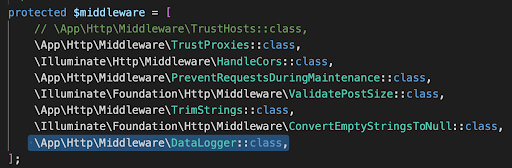
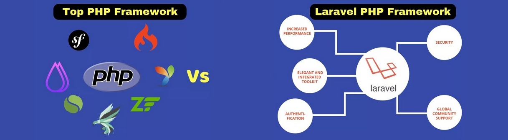

# Продвинутое программирование на PHP — Laravel
## Урок 8. Сервисы: создание и использование
### Домашнее задание
  
Цели практической работы: 

Научиться: 

— создавать свои сервисы на Laravel; 
— работать с логами Laravel и их обработкой. 

Что нужно сделать: 

В этой практической работе вы разработаете сервис логирования, который: 
— фиксирует обращения к сайту; 
— собирает их в базе данных с возможностью отключения системы логирования; 
— отражает в реальном времени HTTP-запросы к приложению. 

Создадим новый проект: 

composer create-project laravel/laravel log-service

1. Для начала создадим модель логов. Для создания модели необходимо использовать artisan с параметром make:model. 
   В итоге наша команда будет выглядеть так: 

php artisan make:model Log

По умолчанию модель создаётся в ./app/Models/Log.php. 
Модель создана, для избежания ошибок запросов SQL необходимо отключить автоматические метки времени. 
 
2. Теперь опишем миграцию для создания нашей таблицы логов: 

php artisan make:migration create_logs_table

Напомним, что таблицы миграции создаются по умолчанию в /database/migration/current_date_time_create_logs_table.php. 

По умолчанию создаётся файл, содержимое которого выглядит так: 
 
В этом файле нам нужно определить поля, которые будет собирать наш сервис логирования: 
— time — время события; 
— duration — длительность; 
— IP — IP-адрес зашедшего пользователя; 
— url — адрес, который запросил пользователь; 
— method — HTTP-метод (GET, POST); 
— input — передаваемые параметры. 

В итоге файл должен приобрести такой вид: 
 

3. Миграция создана, параметры описаны. Теперь создадим таблицу. 

Напоминаем, что таблица создаётся также через artisan c параметром migrate php artisan migrate.

4. База данных подготовлена, теперь нужно создать звено (middleware) для обработки HTTP-запросов. Напоминаем, что звенья создаются при помощи команды php artisan make:middleware название модели.

В нашем случае нам нужна команда: 
php artisan make:middleware DataLogger

По умолчанию звено (посредник) создастся по пути ./app/Http/Middleware/DataLogger.php. 
Теперь необходимо настроить middleware. Открываем Datalogger.php. Добавим использование созданной модели. 
 
Также нужно завершить создание middleware DataLogger, зарегистрировать его в ./app/Http/Kernel.php. 
 
5. Модель создана, посредник HTTP-запросов настроен и зарегистрирован как класс в Kernel.php. Если сейчас запустить Laravel командой php artisan serv, всё будет работать. Логи будут записываться в базу данных.
   Но увидеть это можно только в самой базе SQL. Для получения более наглядных результатов необходимо создать в web.php эндпоинт.
    
   Также для этого эндпоинта необходимо создать blade-шаблон: ./resource/view/logs.blade.php

В нём создать запрос к базе SQL и вывод логов в таблицу. 
 
Запускаем приложение, при открытии вашего приложения http://localhost:8000/logs должна открываться таблица с логами обращения к сайту.

  

**В качестве решения приложить:**  
➔ ссылку на репозиторий с домашним заданием  
⚹ записать необходимые пояснения к выполненному заданию 

**Критерии оценки работы:**  

**Принято:**  

— выполнены все пункты работы;  
— Сервис запускается без ошибок.  
— Логи HTTP-запросов фиксируются в БД.  
— Логи отображаются в веб-интерфейсе в реальном времени.  

**На доработку:**  
— выполнены не все пункты работы;  
— работа выполнена с ошибками.  

**Как отправить работу на проверку:**  

Отправьте коммит, содержащий код задания, на ветку master в вашем репозитории и пришлите его URL (URL Merge Request’а) через форму. Репозиторий должен быть public.

   