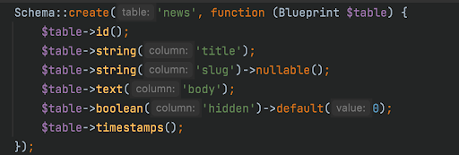
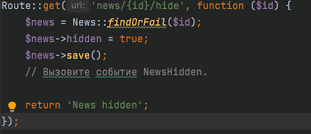

# Продвинутое программирование на PHP — Laravel
## Урок 9. Работа с событиями
### Домашнее задание
  
Цели практической работы: 

Научиться: 

— создавать события и вызывать их; 
— создавать слушатели и привязывать их к событию; 
— применять наблюдатели моделей. 

Что нужно сделать: 

1. Создайте новый проект Laravel или откройте уже существующий. 

2. Создайте новую ветку вашего репозитория от корневой (main или master). 

3. Создайте миграцию командой php artisan make:migration CreateNewsTable со следующими полями: 
 
4. Создайте модель News. 

5. Создайте событие NewsHidden и присвойте полю класса $news параметр $news в конструкторе класса. 
    
6. Создайте слушатель NewsHiddenListener, в котором опишите логику слушателя, используя функцию: 
   Log::info(‘News ’ . $event->news->id . ‘ hidden’);.

7. Зарегистрируйте событие и слушатель в классе EventServiceProvider.

8. В файле routes/web.php создайте необходимый маршрут ‘/news/create-test’, использующий метод get для создания тестовой новости, и пропишите логику создания тестовой новости. 
    
9. В файле routes/web.php создайте необходимый маршрут, использующий метод get ‘/news/{id}/hide’ для скрытия новости. Измените атрибут is_hidden на значение true. После этой операции вызовите событие NewsHidden с помощью инструкции NewsHidden::dispatch($news);. 
    
10. В файле storage/logs/laravel.log проверьте, сработал ли слушатель, в нём должна появиться строка ‘News hidden 1’, где 1 — это id скрытой новости (может отличаться). 

11. Создайте класс-наблюдатель NewsObserver.

12. Зарегистрируйте его в файле App\Providers\EventServiceProvider в функции boot.

13. Опишите логику изменения поля slug новости при вызове события saving в наблюдателе NewsObserver с помощью инструкции.
     
    Эта инструкция использует класс Str, который можно подключить с помощью инструкции в начале файла.
     
14. Создайте ещё одну новость с помощью маршрута ‘/news/create-test’.

15. Проверьте заполнение поля slug через базу данных. Оно должно выглядеть следующим образом: «test-news-title» (если вы оставили такое же название, как в примере).

16. Сделайте коммит изменений с помощью Git и отправьте push в репозиторий.

  

**В качестве решения приложить:**  
➔ ссылку на репозиторий с домашним заданием  
⚹ записать необходимые пояснения к выполненному заданию 

**Критерии оценки работы:**  

**Принято:**  

— выполнены все пункты работы;  
— в работе используются указанные инструменты, соблюдены условия;  
— код корректно отформатирован по стандартам программирования на PHP;  
— код запускается, выводит данные на экран, не вызывает ошибок.  

**На доработку:**  
— выполнены не все пункты работы;  
— работа выполнена с ошибками.  

**Как отправить работу на проверку:**  

Отправьте коммит, содержащий код задания, на ветку master в вашем репозитории и пришлите его URL (URL Merge Request’а) через форму. Репозиторий должен быть public.

   